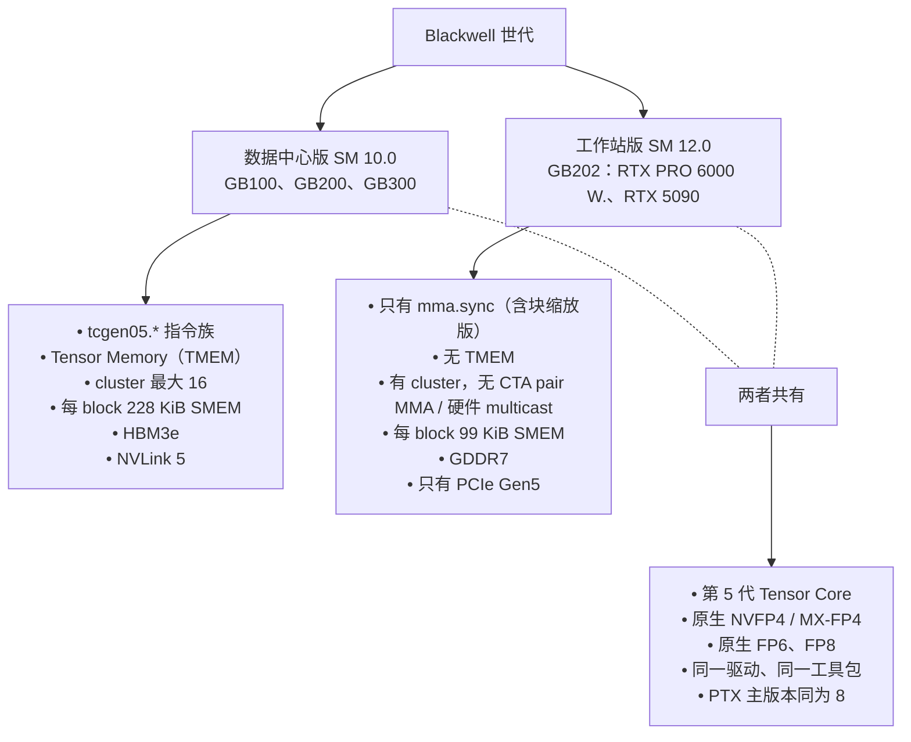

# Blackwell

NVIDIA 在 2024–2026 年间推出的 GPU 世代。本节介绍 Blackwell 与前几代架构的差异，更重要的是，介绍 **Blackwell 的两个分支**彼此之间的差异。

## 本节页面

- [`sm100-vs-sm120`](sm100-vs-sm120.md) —— 两个分支的架构差异，详细版
- [`tcgen05-and-tmem`](tcgen05-and-tmem.md) —— 新的 Tensor Core 指令族（仅数据中心版）
- [`thread-block-clusters`](thread-block-clusters.md) —— 多 CTA 协作，两个分支各能用什么
- [`nvfp4-deep-dive`](nvfp4-deep-dive.md) —— NVIDIA 自己的 FP4 变体，两个分支都原生支持

## 不在本节的内容

- **Tensor Core 的通用背景**：见 [`fundamentals/tensor-cores`](../fundamentals/tensor-cores.md)。
- **NVFP4 在整个数值格式版图里的位置**：见 [`fundamentals/number-formats`](../fundamentals/number-formats.md)。
- **互连与 MoE**：见 [`interconnect/`](../interconnect/index.md)。严格说 NVLink 也是 Blackwell 这一代的特性，但它在概念上属于互连，所以单独成节。

## 全景图

## 阅读顺序

先读 [`sm100-vs-sm120`](sm100-vs-sm120.md)——它是核心页面，列出了每一项架构差异，并指向更深入的子页面。然后根据你工作中真正相关的差异，按需读对应的子页面。

## 为什么会分成两支（简述）

NVIDIA 把数据中心版和消费级 Blackwell 分成两个不同的芯片家族，原因有几条，都能从侧面看出来：

- **芯片面积的经济账**：TMEM、大规模 NVLink 桥接、HBM 控制器都很吃 mm²。消费卡要是把这些都塞进去，定价就很难有竞争力。
- **负载不同**：消费级 Blackwell 面向可视化、内容创作和小规模 ML。`tcgen05` 只对非常大的 MMA 才有用，在消费级这个规模上，为它付出的代价不划算。
- **产品分级**：NVIDIA 希望数据中心级的特性留给付费客户。

这**并不新鲜**——Volta 和 Turing 就是这样分的，Ampere（数据中心版 A100 对 RTX 30）和 Hopper（H100 对……没有消费级 Hopper，因为那个位置被 Lovelace 占了）也一样。Blackwell 这次分家之所以特别，主要是因为 NVIDIA 产品线里两边的**产品名**挨得太近。光是“RTX PRO 6000 Blackwell”这一个品牌就有 Server Edition、Workstation Edition 和 Max-Q 三种变体，*全是 SM120*（GB202）；而“B200”/“GB200”/“GB300”才是 SM100（数据中心版）产品。买家偶尔会以为“Server Edition”或者 96 GB 的标签就意味着 SM100，这两个信号都靠不住。
