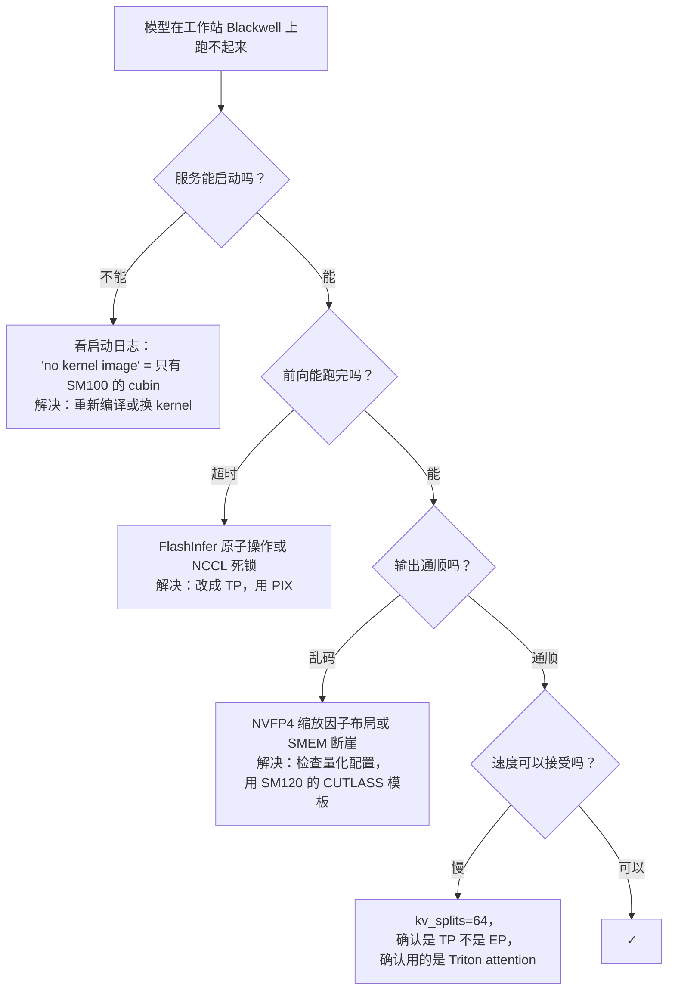

# 消费级 Blackwell 上的通用 MoE

一套诊断流程，适用于任何还没进案例分析的 MoE 模型。遇到新发布的模型时，按这份清单过一遍。

## 第 1 步：了解模型发布信息

读模型卡和发布说明，回答下面几个问题：

- **总参数和激活参数**：NVFP4 量化版本能装进你的显存预算吗？
- **专家数和 top-k**：N 大、k 也大的模型更吃带宽
- **Attention 变体**：MHA / GQA（到处能跑）还是 MLA / DSA / NSA / 定制（依赖特定 kernel）
- **参考推理引擎**：vLLM、sglang、TRT-LLM，还是某个定制分支？
- **参考量化格式**：NVFP4？MX-FP4？FP8？GPTQ？
- **他们测试用的硬件**：H100、B100、NVL72？这能告诉你他们默认了什么。

如果模型卡提到了 DeepGEMM、NVSHMEM、DeepEP，或者针对 `sm_100a` 的专门编译，那在工作站 Blackwell 上就要做好出问题的准备。

## 第 2 步：检查 kernel 依赖面

模型依赖的每个 kernel 库，都对照 [`kernels/`](../kernels/index.md) 查一下它的 SM120 状态：

| 库 | SM120 状态 |
| --- | --- |
| CUTLASS | ✓ 有注意事项（SMEM 断崖） |
| FlashAttention 2 | ✓ |
| FlashAttention 3 | ✗ 没有 Blackwell 移植 |
| FlashInfer（attention） | ✓ |
| FlashInfer（MoE one-shot a2a） | 需要 P2P 原子操作 |
| DeepGEMM | ✗ 截至 2026 年初 |
| 基于 NVSHMEM 的 all-to-all | ✗ 没有 NVLink 就不行 |
| DeepEP（intranode/internode） | ✗ |
| Marlin | ✓ |
| Triton | ✓ |
| TransformerEngine | 部分支持 |

只要碰到 ✗ 的行，就意味着模型的参考部署配方不能直接用，得换替代方案。

## 第 3 步：确定并行方案

考虑到工作站 Blackwell 没有 NVLink，多半也没有 P2P 原子操作：

```
NVFP4 模型 + KV cache 能装进 (N × 96 GB) 吗？
├── 能 → 用 TP=N 并行，不开 EP
└── 不能 → 考虑：
        ├── 剪枝模型（REAP 那种），减少专家数
        ├── PP=2（把层拆到两组 GPU 上），代价是延迟
        └── 更小 / 更低精度的变体（通过 Marlin 跑 W4A16）
```

对于 100B–500B 参数范围内的大多数现代 MoE 模型，有 4× 96 GB 的话，NVFP4 + 纯 TP 是放得下的。

## 第 4 步：配置推理引擎

通用参数模板（换成你的引擎的语法）：

```yaml
quantization: nvfp4
kv_cache_dtype: fp8_e4m3
attention_backend: auto              # 让引擎在 SM120 上自动选 Triton
triton_attention_num_kv_splits: 64   # 影响最大的那个开关
tensor_parallel_size: 4              # 或者你有几张 GPU 就填几
pipeline_parallel_size: 1
disable_deepgemm: true               # 截至 2026 年初仍只支持 SM100
disable_expert_parallelism: true     # 避开 all-to-all
mem_fraction_static: 0.94            # 比 0.97 更稳
```

NCCL 相关的环境变量：

```bash
NCCL_P2P_LEVEL=PIX           # 只在同一交换机下做 P2P；跨 root complex 走主机内存
NCCL_IB_DISABLE=1            # 消费级机器没有 InfiniBand
NCCL_SHM_DISABLE=0           # 允许用主机共享内存
NCCL_BUFFSIZE=4194304        # 4MB 缓冲区
TORCH_NCCL_BLOCKING_WAIT=1
```

## 第 5 步：冒烟测试

三个要求逐级提高的测试：

### A. 启动 + 列出模型

```bash
curl -sS http://localhost:8000/v1/models
```

这一步失败说明启动有问题（kernel 加载、权重加载、NCCL 初始化）。看启动日志。

### B. 短的贪心生成

```bash
curl -sS http://localhost:8000/v1/chat/completions \
  -H 'Content-Type: application/json' \
  -d '{"model":"<model_name>","messages":[{"role":"user","content":"What is 7 squared? One word."}],"max_tokens":10}'
```

应该给出一个通顺的回答。如果出来的是乱码，多半是：

- NVFP4 缩放因子布局不对（无声的数据损坏）
- 某个 CUTLASS 模板撞上了 SMEM 断崖
- KV cache 配置错了

### C. 长上下文连贯性

```bash
# 一段长提示词，关键信息放在约 50k 的位置
prompt="(50k tokens of filler) ... The secret is XYZ. ... (more filler)"
curl ... '{"messages":[{"role":"user","content":"<prompt> What is the secret?"}],"max_tokens":50}'
```

如果短上下文正常、长上下文不行：

- kv_splits 还是默认的 8（改成 64）
- 没选上 Triton attention（强制 `attention_backend=triton`）
- page size 不匹配（试试 `page_size=128`）

## 第 6 步：性能验证

把你的 decode tok/s 和预期值对比：

| 模型规模 | 4 张工作站 Blackwell 上的预期 decode tok/s |
| --- | --- |
| ~250 B 参数 | 50–80 |
| ~478 B（REAP 剪枝后） | 30–50 |
| ~700 B（完整版，带 PP） | 10–25 |
| 100 B 以下 | 80–150 |

如果明显低于这些数字，检查：

- EP 意外开着（看 NCCL trace 里有没有 `all_to_all`）
- attention 后端选错了
- DeepGEMM 意外开着
- 显存压力大（调低 `mem_fraction_static`）

## 诊断流程图



## 模型就是放不下怎么办

有些模型（700 B 以上、专家数不减的那些）即使用 NVFP4 也确实装不进 4× 96 GB。可选的路：

- **等剪枝版发布。**很多前沿实验室会在原版发布几个月后放出 REAP 那种剪枝变体。
- **用更小的变体。**用 V4-Flash 代替 V4，用 256 专家的 K2.6 代替 384 专家的，用 GLM-5.1 REAP-160 代替完整版。
- **TP × PP 混合。**把层拆到两组 GPU 上。每卡显存占用下降，延迟上升。
- **降低精度。**没有 NVFP4 权重的话用 Marlin 的 W4A16。Tensor Core 上比 NVFP4 慢约 2 倍，但能装下更多。

## 关于迭代速度

把一个模型移植到工作站 Blackwell 上，配置要反复调 5–15 轮才能顺畅运行，这很正常。引擎、kernel、量化、KV 格式、attention 后端、并行方案、环境变量——这几个维度的组合空间很大，而且无声的数据损坏很常见。即使有这份清单，每个新模型也要预留一下午的试错时间。

## 另见

- [`compatibility/`](../compatibility/index.md) —— 背后的通用套路
- [`kernels/inference-engines`](../kernels/inference-engines.md) —— 各引擎的具体参数
- 其他案例分析，看具体例子
