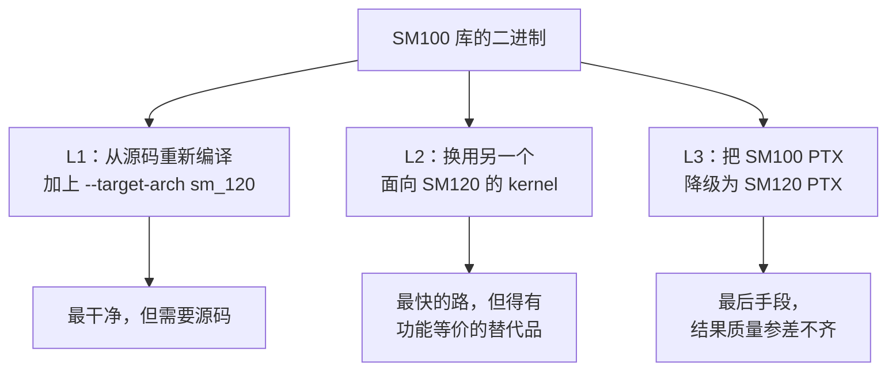

# 兼容性套路

把面向 SM100 的软件搬到 SM120 硬件上跑的通用套路。这里讲的是纯粹的技术手段，不针对某个具体实现。

## 三个层次

每一层都有取舍。选哪条路，取决于你手里有什么，以及你能接受多少性能损失。

## 本节页面

- [`translating-tcgen05`](translating-tcgen05.md) —— 把 `tcgen05` PTX 改写成 `mma.sync` 指令链的套路
- [`smem-budget-management`](smem-budget-management.md) —— 把 kernel 塞进 99 KiB 的 SMEM 上限
- [`cluster-rewriting`](cluster-rewriting.md) —— 假定 cluster 大小 > 1 的 kernel 该怎么办
- [`ep-to-tp-rewriting`](ep-to-tp-rewriting.md) —— 把专家并行方案改造成张量并行方案
- [`runtime-detection`](runtime-detection.md) —— 启动时探测拓扑和架构，据此分发到不同实现

## 什么情况用哪一种

| 情况 | 最佳做法 |
| --- | --- |
| 开源库，你有构建环境 | **L1**：以 SM120 为目标重新编译。最干净。 |
| 预编译库，拿不到源码 | **L2**：替换。换一个已经支持 SM120 的 kernel 库。 |
| 某个特定 kernel 必须能跑，又没有等价替代 | **L3**：降级 PTX。工作量最大、性能最低，但总是可行。 |
| 问题出在并行方案，而不是 kernel | **以上都不用**：直接改写方案。见 [`ep-to-tp-rewriting`](ep-to-tp-rewriting.md)。 |

## 关于思路的说明

这些套路只是**描述技术手段**，不是在推荐某种具体的自动化工具。把它们自动化的工具（兼容层、转译器、方案改写器）确实存在，但套路本身是概念性的：怎样把一个面向 SM100 的东西弄到 SM120 上能跑？

这些套路不会让消费级 Blackwell 跑得和数据中心版 Blackwell 一样快，它们只是让程序**能跑**。性能差距是硬件层面的：内存带宽更小、SM 更少、没有 NVLink。软件手段大概能补上一半的差距，另一半是硅片本身决定的。

## 阅读顺序

如果你在移植某个具体 kernel：读 [`translating-tcgen05`](translating-tcgen05.md) 和 [`smem-budget-management`](smem-budget-management.md)，它们覆盖了最常见的两种 SM100 独有结构。

如果你在系统层面干活：[`ep-to-tp-rewriting`](ep-to-tp-rewriting.md) 是影响最大的套路。方案改写做对了，往往就不再需要 kernel 层面的工作。

如果你在做工具：[`runtime-detection`](runtime-detection.md) 描述了你需要的数据结构和探测手段。
