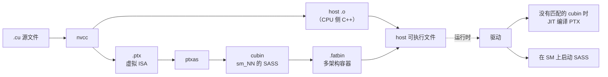

# CUDA 编译流水线

一个 `.cu` 源文件是怎么一步步变成 SM 上执行的指令的。理解这条流水线很关键，因为大多数 SM100/SM120 不兼容问题，都是在*这条流水线的某个环节*上暴露出来的。

## 流水线一览



关键在于，`.cu` 源码要经过**两步编译**：一步高层的（`nvcc` / NVCC 的 PTX 后端），一步低层的（`ptxas`）。每一步都可能因为不同的原因成功或失败。

## 第 1 步：nvcc → PTX

`nvcc` 是一个驱动式编译器，它会：

1. 把 `.cu` 源码拆成 host 代码（C++）和 device 代码（CUDA C++）
2. 用 host 侧的 C++ 编译器（gcc/clang/cl）编译 host 代码
3. 用自己的前端把 device 代码编译成 PTX

PTX（**Parallel Thread eXecution**）是 NVIDIA 的**虚拟 ISA**——一种（在一定范围内）与具体架构无关的中间表示。可以把它理解成专门给 GPU 代码用的 LLVM IR。

用 `--gpu-architecture`（或 `-arch`）指定目标 PTX 版本：

```
nvcc -arch=compute_100 ...  # 面向计算能力 10.0 的 PTX
nvcc -arch=compute_120 ...  # 面向计算能力 12.0 的 PTX
```

PTX **向前兼容**：不带后缀的 PTX（`compute_70`、`compute_90`、`compute_100`）可以被 JIT 编译后跑在任何计算能力更高的设备上。带 `a` 的 PTX 不行：`compute_100a` 的 PTX 只能在 10.0 上跑，`compute_90a` 的 PTX 在 Blackwell 上根本加载不了。`tcgen05` 只在 `compute_100a` 里，不带后缀的 `compute_100` 没有它。

### 这一步会出什么问题

- **指令缺失**：源码用了目标 PTX 版本里没有的内建函数（`__hadd2`、`__nvvm_reflect`、`cp.async.bulk.tensor`）。编译报错。
- **架构专属内建函数用错了目标**：源码用了 `tcgen05.mma`，却用 `-arch=compute_120` 编译。编译报错："instruction not supported in this PTX version"。
- **源码里的向前兼容写错了**：代码用 `__CUDA_ARCH__` 宏把数据中心专属的路径隔开，但条件写错了。这种情况往往能生成可用的 PTX，却在运行时挂掉。

## 第 2 步：ptxas 把 PTX 变成 SASS

`ptxas`（PTX 汇编器）把 PTX 降级成 **SASS**——真正在 SM 上执行的、按架构区分的机器码。SASS 的文档很少；你主要通过 `nvdisasm` 或 `cuobjdump --dump-sass` 跟它打交道。

用 `--gpu-code`（或 `-code`）指定目标 SASS 架构：

```
ptxas --gpu-name=sm_100 ...
ptxas --gpu-name=sm_120 ...
```

或者和 `nvcc` 一起用：

```
nvcc -gencode arch=compute_100,code=sm_100  ...
nvcc -gencode arch=compute_120,code=sm_120  ...
```

`-gencode` 这种写法会为指定架构生成 SASS，*同时*嵌入 PTX（如果二进制跑在一个不在 gencode 列表里的未来架构上，PTX 可以被 JIT 编译）。

### `a` 和 `f` 后缀

NVIDIA 引入了两个后缀来管理架构专属特性：

| 后缀 | 含义 | 示例 |
| --- | --- | --- |
| （无） | 该架构的"可移植"子集 | `sm_100` |
| `a` | "架构专属加速"——使用不可移植的特性。代码*只能*跑在这一个架构上。 | `sm_100a` |
| `f` | "家族专用"（family-specific）——只允许使用在本架构以及同一家族后续架构上都会存在的指令 | `sm_120f` |

实际使用中（`f` 后缀从 CUDA 12.9 起才有）：

- **`sm_100`**（不带后缀）：最保守，**没有 `tcgen05`、TMEM、`cta_group`**。写 `sm_100` 等于自废武功。PyTorch 官方 wheel 的 `TORCH_CUDA_ARCH_LIST` 就是不带 a 的 `10.0`，自己编 CUTLASS 类扩展要显式写 `10.0a`。
- **`sm_100a`**：全部 GB100 专属特性。特性集合的包含关系是 compute_100 ⊂ compute_100f ⊂ compute_100a。编出来的 SASS 只能跑在 10.0 设备上，10.3（B300）都不行。
- **`sm_100f`**：`tcgen05` 主体、TMEM、`cta_group::2`、`setmaxnreg` 都在 f 级；只留在 a 级的是 `kind::i8`、`kind::mxf4 / mxf4nvf4`、随机舍入的 `cvt .rs` 和 `.s2f6x2`。f 级产物在 10.0 和 10.3（B200 和 B300）上都能跑，不能跑 12.x。想一份二进制同时覆盖 B200 和 B300，就编 `sm_100f`。
- **`sm_103a`**：B300 / GB300 专属，比 `sm_100a` 多 K=96、描述符字节寻址模式、96B swizzle、`tcgen05.ld.red`。
- **`sm_120a`**：GB202 专属，主要是块缩放的 `mma.sync`（`kind::mxf4nvf4.block_scale` 等）。
- **`sm_120f`**：能跑在 `sm_120` 和同一家族之后的 12.x 架构上。

判断当前编译目标的宏：`__CUDA_ARCH_SPECIFIC__`（a 目标时定义，值如 1000）和 `__CUDA_ARCH_FAMILY_SPECIFIC__`（a 或 f 目标时定义）有官方文档；`__CUDA_ARCH_FEAT_SM100_ALL` 官方没写但 CUTLASS 在用。CUTLASS 自己的开关是 `CUTLASS_ARCH_MMA_SM100_SUPPORTED / _ENABLED`、`CUTLASS_ARCH_MMA_SM100A_ENABLED` 和 CuTe 的 `CUTE_ARCH_TCGEN05_TMEM_ENABLED`。手写内联 `tcgen05` PTX 时要用这些宏守住：`nvcc -arch=sm_100a` 还会顺带生成一遍不带 a 的 PTX，裸 asm 落到那一遍里 ptxas 就报 "tcgen05.fence not supported on sm_100"。

NVIDIA 自家的库里就能看到后缀的选择：

- CUTLASS 的 Blackwell 模板用 **`sm_100a`**，因为它们需要 `tcgen05`
- 移植到工作站版时会用 **`sm_120`** 或 **`sm_120f`**，不带 `tcgen05`

### 这一步会出什么问题

- **指令不可用**：PTX 里有 `tcgen05.mma`，但 `--gpu-name=sm_120`。ptxas 报错。
- **SMEM 超额分配**：PTX 申请的 SMEM 超过了目标架构的容量。ptxas 可能只给警告，但生成的二进制会在运行时失败。
- **寄存器堆溢出**：PTX 每线程需要的寄存器数超过目标架构支持的上限。ptxas 会把寄存器溢出（spill）到局部内存（一块由 HBM 承载的线程私有区域），很慢。
- **cluster 形状不支持**：PTX 声明了 `.cluster_dim 2,1,1`，但目标架构不支持 cluster，或者支持的最大尺寸更小。

## 第 3 步：cubin 与 fatbin

**cubin** 是针对某一个架构编译出来的二进制：它包含 `sm_NN` 的 SASS，还可以选择性地嵌入 PTX。

**fatbin** 是一个容器，装着多个架构的 cubin，外加可选的 PTX。给 `nvcc` 传多个 `-gencode` 就会得到 fatbin：

```
nvcc -gencode arch=compute_80,code=sm_80 \
   -gencode arch=compute_90,code=sm_90 \
   -gencode arch=compute_100,code=sm_100a \
   -gencode arch=compute_120,code=sm_120 \
   -gencode arch=compute_120,code=compute_120 \
   ...
```

最后一行（`code=compute_120`）嵌入的是 `compute_120` 的 **PTX**，在没有匹配 cubin 的情况下，驱动可以在加载时把它 JIT 编译成 SASS。

### 查看 fatbin 内容

```bash
cuobjdump --list-elf myapp      # 看里面有哪些架构
cuobjdump --dump-elf myapp      # 导出 SASS
cuobjdump --dump-ptx myapp      # 导出嵌入的 PTX
```

实践中就是靠这个发现，某个预编译的库只面向 `sm_100a` 而不是 `sm_120`——它的 fatbin 里只有 `sm_100a` 的 cubin。

## 第 4 步：运行时——驱动、JIT、启动

CUDA 程序加载一个 kernel 时：

1. 驱动在 fatbin 里查找这个 kernel。
2. 如果存在与设备架构匹配的 cubin，驱动直接加载它。
3. 如果没有匹配的 cubin，驱动去找嵌入的 PTX。找到了就 JIT 编译。
4. 两者都没有，kernel 加载失败，报类似 `CUDA error: no kernel image is available for execution on the device` 的错误。

SM120 去加载一个只有 SM100 的 fatbin，就会在这一步失败。**这是用户第一次撞上 SM100/SM120 分裂的地方。**

驱动会把 JIT 结果跨运行缓存起来，所以第一次启动慢，之后就快了。Linux 上缓存位于 `~/.nv/ComputeCache/`。

## Hopper 的二进制到了 B200 会怎样

反过来的方向，把 H100 上的东西搬到 B200，规则是：

- **`sm_90a` 的 cubin 和 PTX 都加载不了。** Blackwell 兼容性指南原话："PTX compiled for compute_90a (Hopper) are not supported on the Blackwell architecture"。`wgmma` 全家（`mma_async / fence / commit_group / wait_group`）在 PTX 里都只有 "Requires sm_90a"。
- **`sm_90`（不带 a）的 cubin 也不行。** cubin 只能在同一主版本、次版本不低的设备上跑，9 → 10 是换主版本。
- **只有不带 a 的 PTX 能 JIT。** 所以一个只嵌了 `sm_90a` cubin、没嵌 `compute_90` PTX 的库，在 B200 上就是 "no kernel image"。用 `CUDA_FORCE_PTX_JIT=1` 跑一遍能验证自己的二进制到底有没有可用的 PTX。
- `mma.sync` 在 `sm_100` 上仍然支持，是唯一不重写就能跑的 MMA 路径；吞吐低于 `wgmma`，更低于 `tcgen05`。

版本门槛：

| 组件 | B200 最低 | 备注 |
| --- | --- | --- |
| CUDA | 12.8（PTX ISA 8.6） | 12.9 加 `f` 后缀和 `sm_103`；13.0 把 `sm_101` 改名 `sm_110`（Thor），删了 Maxwell/Pascal/Volta，没删任何 `sm_100` 目标 |
| 驱动 | 570.26（12.8）/ 575.51.03（12.9）/ 580.65.06（13.0） | |
| CUTLASS | 3.8 | 4.0 起有 CuTe DSL |

CUDA 13.0 还删掉了 `cudaDeviceProp` 里的 `clockRate`、`memoryClockRate`、`computeMode`、`kernelExecTimeoutEnabled` 等字段，改用 `cudaDeviceGetAttribute` 查。老的测试 harness 读这些字段的，在 13.0 下编不过。

## 实例：追查一个 `tcgen05` 错误

假设你 `pip install` 了一个 kernel 库，在 SM120 的卡上跑，得到：

```
CUDA error: no kernel image is available for execution on the device
```

沿着流水线排查：

1. **找到 .so**：定位包含这个 kernel 的共享库。
2. **查看 fatbin**：`cuobjdump --list-elf libfoo.so | grep arch`。输出：
  ```
  arch = sm_90
  arch = sm_100a
  ```
  没有 `sm_120` 的 cubin → 这就是加载失败的原因。
3. **检查有没有 PTX 回退**：`cuobjdump --dump-ptx libfoo.so | head`。如果有 PTX，看它的目标：
  ```
  .version 8.7
  .target sm_100a
  ```
  目标是 `sm_100a` → JIT 到 `sm_120` 同样会失败（1x 家族里的不同大版本分支）。
4. **读 PTX**：搜 `tcgen05`。如果有：
  ```
  tcgen05.alloc.cta_group::1.sync.aligned.shared::cta.b32 [%r5], 128;
  ```
  确认了：这个 kernel 用了数据中心专属指令。没有任何自动回退。

到这一步，解决办法只有：

- 用 `-arch=compute_120` 从源码重新编译，并换一套（面向 SM120 的）实现
- 换一个支持 SM120 的 kernel 库
- 换到数据中心版 Blackwell 的卡上跑

你没法"强行"让 SM100 的 kernel 跑在 SM120 上——两者在机器指令层面就是不同的操作。

## 编译选项速查

想弄清楚发生了什么，最有用的几个 nvcc 选项：

```bash
nvcc -keep -keep-dir build/intermediate ...  # 保留中间文件
nvcc --ptxas-options=-v ...          # ptxas 详细输出：SMEM/寄存器用量
nvcc --resource-usage ...           # 打印每个 kernel 的寄存器/SMEM 用量
nvcc -G ...                  # 生成 device 侧调试信息
nvcc -lineinfo ...              # SASS 里带源码行号信息（给 ncu 用）
```

查看编译产物：

```bash
cuobjdump --list-elf libfoo.so        # 这个 fatbin 里有哪些架构
cuobjdump --dump-elf libfoo.so > sass.txt   # 导出 SASS
cuobjdump --dump-ptx libfoo.so > ptx.txt   # 导出 PTX
nvdisasm sass.txt               # 反汇编 SASS
```

## 自测

你应该能回答：

- PTX 和 SASS 有什么区别？
- `sm_100`、`sm_100a`、`sm_100f` 有什么区别？
- 一个 kernel 在 H100 上能跑、在 B100 上不能跑，最可能的问题是什么？
- 一个 kernel 在 B100 上能跑、在 RTX 5090 上不能跑，最可能的问题是什么？
- 驱动为什么要有 JIT 这条路？

## 另见

- [`tensor-cores`](tensor-cores.md)——`mma.sync` 和 `tcgen05.mma` 到底是什么
- [`blackwell/sm100-vs-sm120`](../blackwell/sm100-vs-sm120.md)——PTX 和 SASS 层面的具体差异
- [`compatibility/translating-tcgen05`](../compatibility/translating-tcgen05.md)——怎么把 SM100 的 PTX 降级成 SM120 的 PTX
- NVIDIA *PTX ISA* 规范（截至 2026 年 9 月为 9.3；原文写 8.5）
- NVIDIA *CUDA Binary Utilities* 文档
