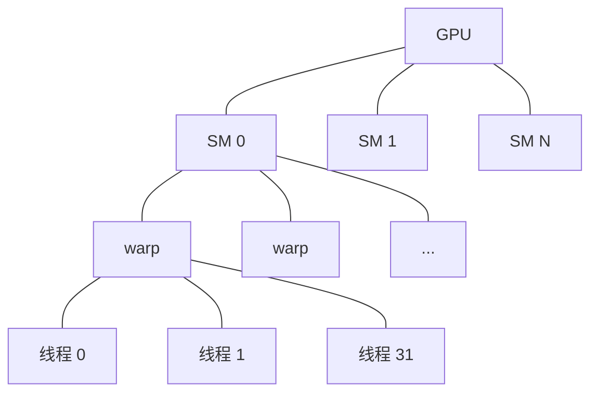

# GPU 执行模型

NVIDIA GPU 怎样执行 kernel。从 kernel 启动一路到单个 lane 的层级结构，以及把它们串在一起的 SIMT（Single Instruction, Multiple Threads，单指令多线程）抽象。

## 层级结构

```
Kernel 启动
 └── Grid           — 一组 CTA（Cooperative Thread Array，协作线程数组）
    └── CTA / "Block"    — 一组 warp；整体驻留在一个 SM 上
       └── Warp      — 32 个线程，锁步执行
          └── Thread  — 一条逻辑执行 lane
```

**kernel** 是一个可以从主机（CPU）代码调用的函数。启动 kernel 就是指定 grid 形状（多少个 CTA）和 block 形状（每个 CTA 多少线程），然后把这次调用排进一条 CUDA 流。驱动把 kernel 送到设备，设备上的 SM 按资源余量领取 CTA，执行随即展开。

| 术语 | 是什么 | 典型大小 |
| --- | --- | --- |
| **Grid** | 一次完整的启动 | 最多 2³¹−1 个 CTA |
| **CTA / Block** | 调度单位，驻留在一个 SM 上 | 32–1024 个线程 |
| **Warp** | 执行单位 | 永远恰好 32 个线程 |
| **Thread / Lane** | 一条逻辑指令流 | 1 |

有两个术语可以互换使用：
- **CTA**（Cooperative Thread Array）— NVIDIA 的正式叫法
- **Block** — CUDA C++ 里的叫法（`__syncthreads()` 同步的是一个 block，等等）

## 流式多处理器（SM）

一块 GPU 就是一堆 **SM**（Streaming Multiprocessor，流式多处理器）。每个 SM：

- 有自己的寄存器、共享内存（SMEM）、L1 缓存
- 从分配给它的 CTA 中调度 warp
- 有自己的 Tensor Core、ALU、特殊函数单元
- 可同时运行来自最多约 16 个不同 CTA 的 warp（取决于占用率）

一块现代 Blackwell GPU 有 60–144 个 SM，视 SKU 而定。SM 数量决定峰值吞吐。



一个 CTA 在启动时被分配到某个 SM，之后整个生命周期都待在那里。CTA 不能在 SM 之间迁移。

## SIMT 执行

同一个 warp 里的线程**锁步执行同一条指令**。这就是"单指令多线程"抽象：32 个线程发射同一个操作，各自处理自己的数据。

遇到分支分歧（warp 里一部分线程走 `if`，另一部分走 `else`）会怎样？硬件会把两条路径**串行化**——先执行 `if` 分支、把走 `else` 的线程屏蔽掉，再执行 `else` 分支、把走 `if` 的线程屏蔽掉。这叫 **warp 分歧**，是首要的性能隐患之一。

warp 内部，线程之间可以通过这些方式通信：

- **warp shuffle** 指令（`__shfl_sync`、`__shfl_up_sync` 等）— lane 之间寄存器到寄存器的直接传输
- **warp vote** 指令（`__ballot_sync`、`__all_sync`、`__any_sync`）— 集体谓词
- **warp matrix** 指令（`mma.sync`）— Tensor Core 的 MMA，后面会讲

同一个 CTA 内、跨 warp 的线程通信方式：

- **共享内存**（SMEM）— 由程序员管理的暂存区
- **`__syncthreads()`** — 屏障同步

跨 CTA 在标准模型里没有同步手段——CTA 彼此独立，完成顺序不定。**线程块簇**（cluster，Hopper 及之后）改变了这一点，我们会在 [`blackwell/sm100-vs-sm120`](../blackwell/sm100-vs-sm120.md) 里讲。

## 占用率

一个 SM 能同时跑多少个 CTA 的多少个 warp，受这些因素限制：

- **寄存器压力** — 每个线程占 N 个寄存器；SM 的寄存器堆是固定的（例如每 SM 64K 个 32 位寄存器）
- **每个 CTA 的 SMEM 用量** — 受每 SM 的 SMEM 总量限制（例如 SM120 上是 99 KiB）
- **每 SM 线程数** — 硬件上限，通常是 1024 或 2048
- **每 SM 的 CTA 数** — 硬件上限，通常是 32

这些约束共同决定了**占用率**——实际驻留的 warp 数占理论最大值的比例。占用率高有助于掩盖延迟（一个 warp 停住了，另一个顶上）；占用率过高则会把寄存器和 SMEM 摊得太薄。

Tensor Core 密集型 kernel 往往会有意跑在相对**低**的占用率下——它们每个 warp 需要更多寄存器和 SMEM 来喂饱矩阵乘流水线，而 Tensor Core 本身并不需要很多 warp 就能保持忙碌。

## 异步执行与流

从主机的角度看，kernel 启动是**异步**的。主机把 kernel 排进一条 CUDA 流后就继续往下走；kernel 在设备上等调度允许时再运行。

**流**（stream）是一个有序的操作序列（kernel、memcpy、事件）。同一条流内的操作串行执行；不同流之间的操作可以重叠。现代推理引擎会大量使用多条流来做流水线。

## 协作组（简述）

CUDA 提供了 `cooperative_groups` 命名空间，把 warp/block/cluster 层级抽象出来。现代 CUDA C++ 里会见到 `tile<32>`、`block_tile<32>`、`coalesced_threads` 等。它基本上是在上面描述的底层层级之上包了一层，方便使用。

## 这对 Blackwell 意味着什么

执行模型上有两个变化是 SM100/SM120 故事的核心：

1. **线程块簇**（Hopper 引入，数据中心版 Blackwell 扩展）：把多个 CTA 编成一组，共享一个 SM 簇的分布式共享内存。SM100 支持最大 **cluster size 16**；SM120 最大 **8**。SM120 上没有的是建在 cluster 之上的 CTA pair MMA 和硬件 multicast TMA。

2. **一切皆异步**：SM100 的 `tcgen05` 指令族把 Tensor Core 的执行与 warp 的执行解耦。MMA 异步发出，warp 继续往下跑，同步靠 Tensor Memory 或完成屏障来做。这把 SIMT 模型推到了前所未有的程度。SM120 没有 `tcgen05`，只能停留在老式的同步 `mma.sync` 风格。在 SM100 上依赖异步重叠的 kernel，移植过去就失去了这种重叠。

这两个变化在 [`blackwell/sm100-vs-sm120`](../blackwell/sm100-vs-sm120.md) 和 [`blackwell/tcgen05-and-tmem`](../blackwell/tcgen05-and-tmem.md) 里都有讲。

## 自测

读完你应该能回答：

- 线程、warp、CTA 之间有什么区别？
- warp 内的线程怎样通信？
- CTA 内的 warp 怎样通信？
- 为什么一个 kernel 会有意跑在 25 % 的占用率？
- 执行期间 CTA 和 SM 是什么关系？

## 另见

- [`memory-hierarchy`](memory-hierarchy.md) — 在这个执行模型下数据怎样流动
- [`tensor-cores`](tensor-cores.md) — 矩阵乘硬件
- NVIDIA *CUDA C++ Programming Guide* 第 5 章（Execution Model）和第 12 章（Cooperative Groups）
