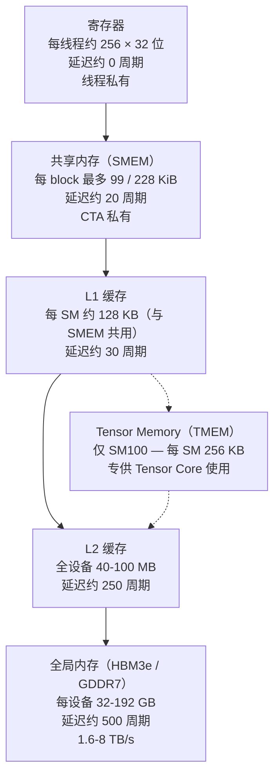

# 内存层级

数据在 GPU 上放在哪。一共六层，每层的容量、带宽、延迟和可见范围都不一样。

## 金字塔



箭头表示典型计算 kernel 的**数据流**：从全局内存加载 → 暂存到共享内存 → 在寄存器中消费 → 结果沿同一条链路写回。

## 逐层细节

### 寄存器

- **容量**：每线程 255 个 32 位寄存器（CUDA 的上限，用 `__launch_bounds__` 可能会更低）
- **延迟**：基本为零
- **带宽**：每 SM 约 30 TB/s（每个线程每周期可读取多个寄存器）
- **范围**：线程私有，不共享
- **分配**：由编译器完成；你控制不了哪个变量落在哪个物理寄存器，但你能控制有哪些变量

对计算密集型 kernel 来说，寄存器堆是占用率的瓶颈。每个 SM 的寄存器堆是固定的（例如 64K 个寄存器）；256 寄存器/线程 × 32 线程/warp × 8 warp/CTA × 2 CTA/SM ≈ 128K——已经超预算了。所以实际上你得妥协：降低每线程寄存器用量，或减少并发 CTA 数，或两者都做。

### 共享内存（SMEM）

片上由程序员管理的暂存区。**这是整份 wiki 里最重要的一个数字：**

| 架构 | 每 block 上限 | 每 SM 总量 |
| --- | ---: | ---: |
| Volta（SM 7.0） | 96 KiB | 96 KiB |
| Ampere（SM 8.0） | 164 KiB | 164 KiB |
| Hopper（SM 9.0） | 228 KiB | 228 KiB |
| **数据中心版 Blackwell（SM 10.0）** | **228 KiB** | 228 KiB |
| **工作站 Blackwell（SM 12.0）** | **99 KiB** | 99 KiB |

工作站 Blackwell 的 99 KiB 上限比它 Hopper 时代的表亲*低得多*。许多内核库（CUTLASS、FlashAttention）的模板会按 228 KiB 的上限自动计算流水线级数。在 SM120 上，这些模板申请的 SMEM 超出了可分配的量。后果见 [`blackwell/sm100-vs-sm120`](../blackwell/sm100-vs-sm120.md)。

SMEM 的特性：

- **延迟**：约 20–30 周期
- **带宽**：每 SM 约 10 TB/s（bank 访问无冲突时）
- **范围**：CTA 私有
- **bank**：SMEM 分 32 个 bank；连续的 4 字节字映射到连续的 bank。bank 冲突（同一 warp 里两个线程访问同一个 bank 的不同地址）会被串行化。

CUDA 提供静态 SMEM（编译期定大小，用 `__shared__` 声明）和动态 SMEM（启动时定大小，通过启动配置的第三个参数启用）。动态 SMEM 若超过该架构的"默认"划分量（大多数架构上是 49 KiB），需要在启动前调用 `cudaFuncSetAttribute(kernel, cudaFuncAttributeMaxDynamicSharedMemorySize, N)`。

### Tensor Memory（TMEM）

**仅 SM100。** 随数据中心版 Blackwell 新引入的一类片上内存（张量内存）。用来存放 Tensor Core 的累加器，与寄存器解耦。

- **容量**：每 SM 256 KB（独立于 SMEM）
- **带宽**：足以让 `tcgen05.mma` 跑满峰值
- **范围**：warp 组/CTA，通过 `tcgen05.alloc` 分配
- **延迟**：被异步的 TMA / `tcgen05.commit` 操作掩盖

TMEM 存在的原因是：`tcgen05.mma` 的累加器很大——单 CTA 最大的 m128n256 tile 有 128×256 个 FP32，就是 128 KB；CTA pair 的 m256n256 更是 256 KB（译注：原文写"m256n128k64 的累加器 32 KB"，32K 是元素个数，不是字节数；tile 上限也按 PTX ISA 改了）——远超寄存器能装下的量，放 SMEM 也不合适（会吃掉整个预算）。TMEM 给了 Tensor Core 一块私有的累加器空间，把寄存器和 SMEM 腾出来干别的。

**SM120 没有对应的东西。** 任何用到 TMEM 的 kernel 都必须重写：要么切成更小的 tile（累加器小到能放进寄存器），要么把累加器经由 SMEM 中转（占用那 99 KiB 的预算）。见 [`compatibility/translating-tcgen05`](../compatibility/translating-tcgen05.md)。

### L1 / L2 缓存

**L1**：每 SM 一份，与 SMEM 共用硬件预算。L1+SMEM 合计在 Hopper/数据中心版 Blackwell 上是每 SM 256 KB（其中最多 228 KB 可配置给 SMEM），在工作站 Blackwell 上是每 SM 128 KB（译注：原文把合计写成 228 KiB，那是 SMEM 可配置的最大值，不是 L1+SMEM 的总量）。L1 与 SMEM 之间的划分是动态的；你申请的 SMEM 划分量决定了 L1 的大小。

**L2**：全设备共享，H100 上 40 MB，B100 上 50 MB，B200 上约 96 MB，消费级 Blackwell 上略小一些。L2 缓存对全局内存的访问，掩盖一部分 HBM 延迟。

缓存基本是自动的，你不直接管理它们。缓存控制提示（`ld.cg`、`ld.cs`、`ld.ca`）可以让你对层级行为稍加引导。

### 全局内存（HBM / GDDR）

片外设备内存。最深、最慢、最大的一层。

| GPU | 内存类型 | 容量 | 带宽 |
| --- | --- | ---: | ---: |
| A100 80GB | HBM2e | 80 GB | 2.0 TB/s |
| H100 80GB | HBM3 | 80 GB | 3.4 TB/s |
| H200 | HBM3e | 141 GB | 4.8 TB/s |
| B100 | HBM3e | 192 GB | 8.0 TB/s |
| B200 | HBM3e | 192 GB | 8.0 TB/s |
| RTX PRO 6000 Workstation | GDDR7 | 96 GB | ~1.8 TB/s |
| RTX 5090 | GDDR7 | 32 GB | ~1.8 TB/s |

数据中心 HBM 与消费级 GDDR 之间的带宽差距大约是 **4–5 倍**。对访存受限的负载（长上下文 decode 基本就是这类）来说，这是软件手段无法弥补的架构性能差距之一。

访问模式很关键：完全**合并**的访问（一个 warp 的 32 个线程访问连续的 128 字节段）能达到峰值带宽。分散或跨步访问可能只剩峰值的一小部分。上表的 HBM/GDDR 带宽都是峰值；实际能拿到多少取决于你的访问模式。

## 一个具体的算例

假设你在写一个 NVFP4 精度的 CUTLASS GEMM，tile 形状为 `m128n128k64`：

- **操作数**：`A` 是 128×64 = 8192 个元素，每个 4 位，即 4096 字节（另加缩放因子）。`B` 是 64×128 = 4096 字节。每个 tile 的操作数合计约 9 KB。
- **流水线级数**：为了让加载与计算重叠，通常会在 SMEM 里放 3–4 级操作数。4 级 × 9 KB = 36 KB。
- **累加器**：128×128 × 4 字节（FP32 累加）= 64 KB。在 SM100 上它放在 TMEM 里。在 SM120 上它只能放寄存器（放不下）或 SMEM（预算会涨到 36 + 64 = 100 KB——*超过*了 99 KiB 的上限）。

这就是 SMEM 断崖的具体形态。CUTLASS 的 Blackwell 模板在 SM100 上靠 TMEM 解决它，SMEM 预算全留给操作数。没有 TMEM 时，模板的 `StageCountAutoCarveout` 会低估可用 SMEM，分配得过于激进，启动后就会破坏相邻的 bank。

## 访存相关的 PTX

三种加载指令，按范围排列：

```ptx
ld.global.u32 %r0, [%addr];   // 全局内存加载
ld.shared.u32 %r0, [%addr];   // SMEM 加载
ld.local.u32  %r0, [%addr];   // 线程本地内存加载（寄存器溢出）
```

面向 Tensor Core 的工作还有一些专用加载指令：

```ptx
ldmatrix.sync.aligned.x4.shared.b16  ...   // 从 SMEM 加载矩阵 tile（Ampere+）
cp.async.ca.shared.global             ...   // 异步拷贝 全局→SMEM（Ampere+）
cp.async.bulk.tensor.shared::cluster.global ... // TMA（Hopper+，数据中心版）
tcgen05.cp.cta_group::1.128x256b      ...   // SMEM→TMEM 拷贝（仅数据中心版 Blackwell）
tcgen05.ld.sync.aligned.32x32b.x32.b32 ... // TMEM→寄存器（仅数据中心版 Blackwell）
```

与 SM100 相比，SM120 上可用的访存指令集明显缩水。具体来说，**TMEM 拷贝、簇级共享的 TMA，以及 `tcgen05.cp` 在 SM120 上都不存在**。

## 自测

读完你应该能回答：

- 工作站 Blackwell 每 block 的 SMEM 上限是多少？数据中心版呢？
- SM100 的 TMEM 为什么存在？SM120 用什么代替？
- 一次内存访问"合并"是什么意思？
- 数据中心 HBM3e 与工作站 GDDR7 的带宽比大致是多少？
- 为什么 L1+SMEM 的划分有时被叫作"carveout"？

## 另见

- [`gpu-execution-model`](gpu-execution-model.md) — 线程/warp/CTA 怎样与这套层级打交道
- [`tensor-cores`](tensor-cores.md) — 谁在消费 Tensor Memory 这一层
- [`blackwell/sm100-vs-sm120`](../blackwell/sm100-vs-sm120.md) — SMEM 与 TMEM 差异的详细讨论
- NVIDIA *CUDA C++ Programming Guide* 第 6 章（Memory Hierarchy）
