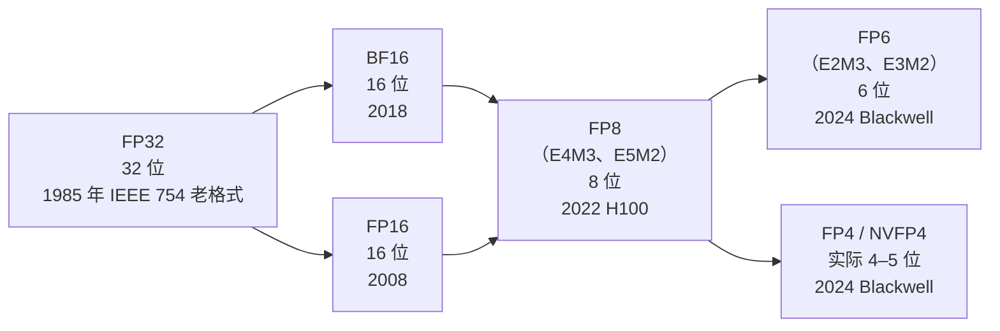

# 数值格式

Tensor Core 所乘的每一个数是怎么编码的。格式的多样化，是 Hopper 到 Blackwell 这个时代的主线故事。

## 位宽演进



每一代格式大致把**存储减半**，同时对 ML 负载仍保留可用的精度。诀窍是越来越激进的**缩放**：位宽降下去以后，动态范围成了瓶颈，所以这些格式把数值分成块，每块配一个缩放因子。

## 浮点格式速成

一个浮点数是 `(符号)(2^指数)(1.尾数)`，指数带偏置。编码占 **1 + E + M 位**，E 是指数位数，M 是尾数位数。E 越多，范围越宽；M 越多，精度越细。

| 格式 | 位数 | E | M | 范围（约） | 精度（约） |
| --- | ---: | ---: | ---: | --- | --- |
| FP32（IEEE 754） | 32 | 8 | 23 | ±10⁻³⁸ 到 ±10³⁸ | 约 7 位十进制 |
| TF32（Tensor Core 内部格式） | 19 | 8 | 10 | ±10⁻³⁸ 到 ±10³⁸ | 约 3 位十进制 |
| FP16（IEEE 754 binary16） | 16 | 5 | 10 | ±6×10⁻⁵ 到 ±65 504 | 约 3 位 |
| BF16（Brain float） | 16 | 8 | 7 | ±10⁻³⁸ 到 ±10³⁸ | 约 2 位 |
| FP8 E4M3 | 8 | 4 | 3 | ±2⁻⁹ 到 ±448 | 约 1.3 位 |
| FP8 E5M2 | 8 | 5 | 2 | ±2⁻¹⁶ 到 ±57 344 | 约 1 位 |
| FP6 E2M3 | 6 | 2 | 3 | ±0.0625 到 ±7.5 | 约 1 位 |
| FP6 E3M2 | 6 | 3 | 2 | ±10⁻³ 到 ±28 | 不到 1 位 |
| FP4 E2M1 | 4 | 2 | 1 | ±0.5 到 ±6 | 不到 1 位 |

几个规律：

- **BF16 vs FP16**：位数相同，切分不同。BF16 拿精度换范围——指数范围和 FP32 一样，训练中途就不会出现数量级丢失的问题。正因如此，ML 很快就把训练格式从 FP16 统一到了 BF16。
- **FP8 E4M3 vs E5M2**：E5M2 范围更宽，训练时用于梯度。E4M3 精度更高，推理时用于激活和权重。
- **FP6 和 FP4**：动态范围小得可笑。这些格式**只有**在块量化形式下、配上每块一个缩放因子才有用。

## 块量化格式

对 8 位以下的格式，数值本身的范围不够用。所以格式给每个数值配一个由一整块数值共享的**缩放因子**：

```
16 个元素的块       | 缩放因子（1 个）
[v0 v1 v2 ... v15]    | s
             ▼
v_i 的真实值 = v_i * s
```

不同格式的区别在于：

- **块大小**（多少个数值共享一个缩放因子）
- **缩放因子类型**（缩放因子本身用什么格式）
- **缩放因子的排布**（缩放因子在内存里相对数值放在哪）

### MX-FP4（Open Compute Project 微缩放格式）

OCP 标准化的块 FP4 格式：

- **块大小**：32 个元素
- **缩放因子类型**：E8M0（8 位，只有指数，只能表示 2 的整数次幂）
- **排布**：32 个元素（打包成 16 字节）+ 1 个缩放因子（1 字节）
- **每元素实际位数**：32×4/32 + 8/32 = 4.25 位

AMD、Intel、ARM 等厂商都采用了它，作为多厂商通用标准。

### NVFP4（NVIDIA 的变体）

NVIDIA 的变体把两项都收紧了：

- **块大小**：16 个元素（更小 → 对张量各局部区域的动态范围跟得更紧）
- **缩放因子类型**：FP8（E4M3）（缩放因子精度更高）
- **排布**：16 个元素（打包成 8 字节）+ 1 个缩放因子（1 字节）
- **每元素实际位数**：16×4/16 + 8/16 ≈ 4.5 位

比 MX-FP4 多占一点存储（每元素约 4.5 位 vs 约 4.19 位），但在 ML 负载上实际精度更好——块更小，意味着范围不均匀的张量（比如有逐通道离群值的）能拿到更贴合的缩放因子。

**关键的是：SM100 和 SM120 的 Tensor Core 都原生支持它。** 这是少有的在 Blackwell 两个半边上都真正一样能用的格式。

### 为什么两种 FP4 格式并存

NVFP4 归 NVIDIA 所有，NVIDIA 出的硬件原生支持它。OCP 的 MX-FP4 标准之所以存在，是因为整个行业不想被绑死在 NVIDIA 的规格上。有些库（DeepGEMM）同时提供 NVFP4 和 MX-FP4 两条路径；有些（CUTLASS）在 NVIDIA 硬件上偏向 NVFP4。

一个常见的 bug：库编译时走的是 MX-FP4 路径，加载的权重却是按 NVFP4 格式存的。两者缩放因子的排布不同，kernel 会把 16 个一组的 E4M3 缩放因子当成 32 个一组的 E8M0 来读，不报错，但输出全是垃圾。

## 各格式用在哪

现代 MoE 模型的典型推理部署会**同时使用多种格式**：

| 用途 | 常见格式 |
| --- | --- |
| 模型权重 | NVFP4（每元素约 4.5 位） |
| KV cache | FP8 E4M3 |
| prefill 阶段的激活 | BF16 或 FP8 |
| decode 阶段的激活 | BF16 |
| Tensor Core 累加器 | FP32 |
| LayerNorm / softmax | FP32 |
| 注意力分数 | FP16 或 BF16 |
| 最终 logits | FP32 |

Tensor Core 可以在一条指令里把低精度输入乘进高精度累加器。所以大块的 GEMM 以 NVFP4 输入/FP32 累加的吞吐运行，而敏感的操作（归一化、softmax）保持 FP32。

## 转换问题

真实的推理过程中格式之间**转换不断**。一个典型层的数据流：

```
权重（HBM 里的 NVFP4）
   │ 加载 + 反量化
   ▼
操作数 A（寄存器里的 BF16）
   │ Tensor Core MMA（BF16 输入，FP32 累加）
   ▼
结果（TMEM/寄存器里的 FP32）
   │ 激活函数（FP32）
   ▼
激活（寄存器里的 BF16）
   │ 存储 + 量化
   ▼
激活（HBM 里的 FP8，供 KV cache 用）
```

每一次转换都由 kernel 负责。转换路径上的 bug 很常见——而且和架构相关。两边的块缩放 MMA 都在 Tensor Core 内部完成反量化（SM100 的 `tcgen05.mma.kind::mxf4nvf4`、SM120 的块缩放 `mma.sync`），不需要单独的反量化指令；只有走不带块缩放的普通 MMA 时才要先用软件反量化成 FP8/BF16。

## Blackwell 块缩放 MMA 的细节（SM100）

上面讲的是格式本身；`tcgen05` 怎么消费这些格式，有几条硬规矩：

| MMA kind | 元素 | K | 缩放因子 | `scale_vec` |
| --- | --- | --- | --- | --- |
| `kind::mxf8f6f4` | FP8 / FP6 / FP4 混搭 | 32 | UE8M0，32 个一组 | `1X` |
| `kind::mxf4` | FP4 | 64 | UE8M0，32 个一组 | `2X` |
| `kind::mxf4nvf4` | FP4 | 64 | UE8M0（32 个一组）或 UE4M3（16 个一组，即 NVFP4） | `2X` / `4X`（12.9 起也叫 `.block32` / `.block16`） |

- **缩放因子必须在 TMEM**，而且要复制到全部 4 个 32-lane 分区；一个 32 位 TMEM 字最多放同一行的 4 个缩放因子。它们通过 `tcgen05.cp` 从 SMEM 搬进去。
- CUTLASS 规定的 GMEM / SMEM 缩放因子布局是固定的 512 字节基本块（128 行 × K 方向 4 个缩放因子），cuBLAS 用同一布局并注明 "does not allow transposition"。写自己的 kernel 就按这个来，别发明新布局。
- `kind::f8f6f4` / `mxf8f6f4` 里 4 位和 6 位元素**每个占一个 8 位容器**，A、B 五种类型可以任意混搭；只有 `kind::mxf4 / mxf4nvf4` 才是真正每字节 2 个的打包。TMA 配套的解包格式是 `.b4x16_p64`、`.b6x16_p32`。
- NVFP4 的"每张量 FP32 缩放"是软件约定，不是 MMA 指令的一部分；块缩放 UE4M3 是无符号 E4M3。
- INT8 保留（`kind::i8`，只在 `sm_100a`）；**INT4 在 `tcgen05` 和 `wgmma` 里都不存在**，INT4 权重要么走 Marlin 一类的反量化路径，要么换成 FP4。
- 转换指令：`cvt.rn.satfinite.{e2m1x2, e2m3x2, e3m2x2, ue8m0x2}.f32`（PTX 8.6），没有 UE4M3 的 cvt。头文件 `cuda_fp4.h`（`__nv_fp4_e2m1`）、`cuda_fp6.h`、`__nv_fp8_e8m0` 从 CUDA 12.8 起。12.8 的已知问题：C++ 转换构造函数只实现了向零舍入，转 MX 格式别用它。
- cuBLASLt 从 12.8 起支持块缩放：`CUBLASLT_MATMUL_MATRIX_SCALE_VEC16_UE4M3`（NVFP4）、`VEC32_UE8M0`（MXFP8），数据类型 `CUDA_R_4F_E2M1`、`CUDA_R_8F_UE8M0`、`CUDA_R_8F_UE4M3`。cuBLASLt 不做 FP6。

## FP8 累加精度：Hopper 和 Blackwell 不一样

Hopper 的 FP8 Tensor Core 累加时只保留约 13 到 14 个小数位（DeepSeek-V3 技术报告和 PyTorch 博客都实测过），所以 DeepGEMM 在 Hopper 上每累加 128 个 K 就把部分和搬回 CUDA core 用真 FP32 加一次（所谓 promotion）。Blackwell 的 `tcgen05.mma.kind::f8f6f4` 第三方实测保留 25 个小数位（arXiv 2512.07004，B200 实测）。旁证：DeepGEMM 的 SM100 内核删掉了 promotion；cuBLAS 的 `FAST_ACCUM` 文档只列 Ada 和 Hopper。NVIDIA 没有明文。

两个推论：从 Hopper 迁 FP8 kernel 到 B200，不用再手工 promotion；但 B200 上走 `mma.sync` 的 FP8 是转成 FP16 的 HMMA，只有 `tcgen05` 才是真 FP8 路径。

## 关于溢出

到了 FP8 及以下，**溢出是实打实的问题**。一个量化后是较大 E4M3 值的权重，乘上一个量化后也是较大 E4M3 值的激活，就可能超过 448 这个最大可表示值。现代推理栈会用：

- **逐张量缩放**（例如每个权重张量一个缩放因子）
- **逐块缩放**（MX-FP4 / NVFP4 的机制）
- **随机舍入**，避免就近舍入带来的系统性偏差

生产环境的 FP4 推理大多*不*用随机舍入；逐块缩放就够了。FP4 训练则需要随机舍入才能收敛。

## 读懂量化配置

一张现代 Hugging Face 模型卡可能会写：

```yaml
quantization_config:
 quant_method: nvfp4
 block_size: 16
 scale_dtype: fp8_e4m3
 group_size: 16
 weight_dtype: nvfp4
 kv_cache_dtype: fp8_e4m3
```

解读为：权重是 NVFP4（块大小 16，FP8 缩放因子）；KV cache 是 FP8 E4M3（逐 token，不再分块）。如果用一个按 MX-FP4 排布来读的 kernel 加载它，会悄无声息地算错。

## 自测

你应该能回答：

- BF16 和 FP16 有什么区别？
- FP8 E4M3 和 FP8 E5M2 有什么区别？
- MX-FP4 和 NVFP4 是什么关系？一样？不一样？都是？
- 为什么 FP4 需要逐块缩放，而 FP16 不需要？
- 为什么一个"输出 FP32"的 SM100 kernel，几层之后吐出来的激活看起来又是 BF16？

## 另见

- [`tensor-cores`](tensor-cores.md)——这些格式的消费者
- [`blackwell/nvfp4-deep-dive`](../blackwell/nvfp4-deep-dive.md)——NVFP4 深入解析
- [`kernels/deepgemm`](../kernels/deepgemm.md)——DeepGEMM 的 NVFP4 与 MX-FP4 两条路径
- *Open Compute Project Microscaling Format Specification*
- NVIDIA *Blackwell Architecture Whitepaper*，"Tensor Cores Gen 5"一节
