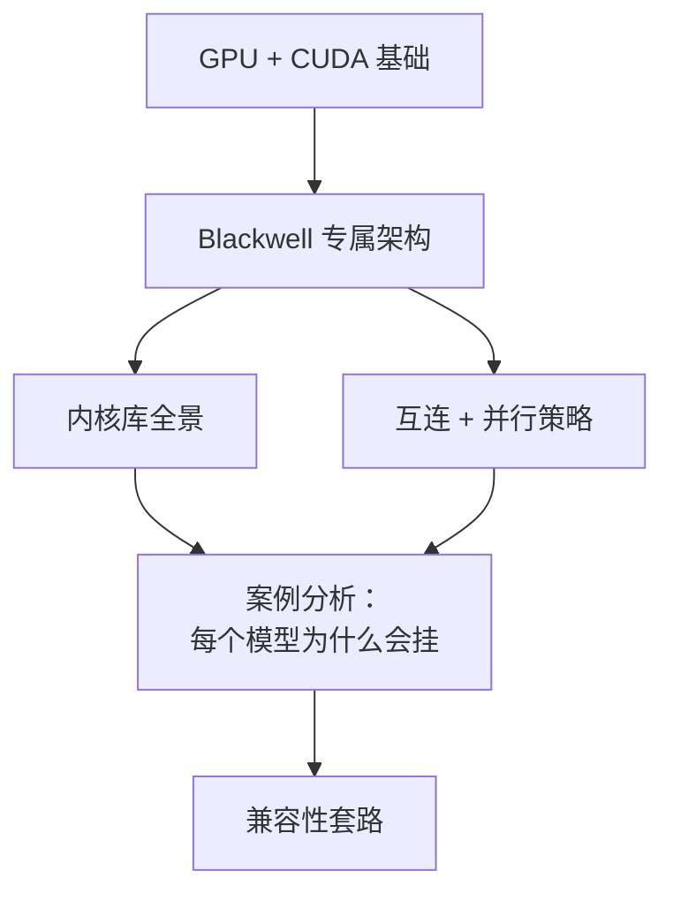

# Blackwell 消费级与数据中心版对比 wiki

这是一份独立的、面向学习的参考资料，用来理解 NVIDIA Blackwell 这一代——具体说是 **SM 10.0**（数据中心版 Blackwell，GB100/GB200/GB300）与 **SM 12.0**（工作站/消费级 Blackwell，GB202：RTX PRO 6000 Workstation、RTX 5090 等）之间的架构分裂。

之所以要写这份 wiki，是因为当下的开放权重模型推理栈（DeepSeek-V3/V4、Kimi-K2、GLM-5.x、Qwen-3-MoE）几乎完全是按数据中心版 Blackwell 的前提构建的：NVLink、Tensor Memory（TMEM）、`tcgen05` 指令、228 KiB 共享内存上限、MNNVL fabric、P2P 原子操作。消费级 Blackwell 和它共用同一个品牌、同一代 Tensor Core，但**并不**共用那套 ISA 和互连能力。为其中一方写的软件，在另一方上会以微妙但可明确界定的方式失败。

如果你手里有一张工作站 Blackwell 卡，并且问过"这东西为什么跑不起来？"——这份 wiki 就是答案。

## 这份 wiki 讲什么

- **[基础](fundamentals/index.md)**：GPU 执行模型、内存层级、CUDA 编译流水线、Tensor Core、数值格式。要读懂 wiki 其余部分所需的最少背景。
- **[Blackwell](blackwell/index.md)**：SM100 与 SM120 的详细对比。`tcgen05`、TMEM、cluster-2 启动、99 KiB 共享内存断崖、NVFP4。
- **[内核库](kernels/index.md)**：CUTLASS、FlashAttention、FlashInfer、DeepGEMM、vLLM、SGLang、TensorRT-LLM、Marlin、Triton、TransformerEngine、NVSHMEM。每个库是干什么的，SM100 与 SM120 的支持从哪里开始分道扬镳，以及怎样从它们的 issue 列表里读出兼容性线索。
- **[互连](interconnect/index.md)**：NVLink、NVSwitch、PCIe 的对比。为什么 MoE 的 all-to-all 受带宽和原子操作双重限制。EP 与 TP 之间的取舍。
- **[案例分析](case-studies/index.md)**：DeepSeek-V3/V4-Flash、Kimi-K2.x、GLM-5.x。逐一分析每个模型及其参考部署方案做了哪些假设，其中哪些在工作站 Blackwell 上不成立。
- **[兼容性套路](compatibility/index.md)**：怎样把 SM100 kernel 翻译到 SM120，怎样为非 NVLink 拓扑重写 EP 方案，怎样在运行时检测拓扑不匹配。讲的是通用技术，不是某个具体实现。
- **[参考](reference/index.md)**：术语表、缩写表、参考文献。

## 这份 wiki 不讲什么

- **训练。** 只讲推理。训练有自己的一套问题（梯度通信、混合精度优化器、故障恢复），这里不涉及。
- **多节点。** 只讲单节点。一旦跨越网络边界，互连这部分的故事会大不一样。
- **Hopper、Ampere 或更早的架构。** 会拿来作对比，但不是重点。
- **AMD、Intel 或其他非 NVIDIA GPU。** 内核库和 ISA 这部分内容是 NVIDIA 专属的。
- **具体商业产品或购买建议。** 这是技术资料，不是推荐清单。

## 读者

这份 wiki 面向三类读者，按受益程度从高到低排列：

1. **手里有一张工作站 Blackwell 卡的 ML 工程师**，想搞清楚为什么某前沿实验室发布的模型 X 跑不起来，或者只能跑到"理论上应有"吞吐的 5 %。建议从头到尾通读。
2. **在数据中心版和消费级 Blackwell 之间移植 kernel 的 CUDA 开发者**。直接跳到 [Blackwell](blackwell/index.md) 和[内核库](kernels/index.md)。
3. **系统研究者或好奇的读者**，想弄明白 Blackwell 这一代的分界线上发生了什么，为什么"同一个架构"会产生两套不同的 ISA。案例分析是最有意思的部分。

## 怎么读

推荐三条阅读路线：

**线性通读（约 3–4 小时）：** 从[基础](fundamentals/index.md)开始，按侧边栏顺序读完每一页。读完之后，你就能不查术语表读懂一条 CUTLASS 的 issue 讨论。

**自顶向下（约 1 小时）：** 先读本篇概览，再读[架构](overview/architecture.md)（一页纸的全局地图），然后直接跳到你真正关心的那个模型的[案例分析](case-studies/index.md)，缺什么前置知识再回头补。

**当参考手册（每次查询约 5 分钟）：** 把[术语表](overview/glossary.md)和[参考索引](reference/index.md)当 man page 用。

## 关于时间点的说明

这份 wiki 反映的是 2026 年初开源 GPU 推理生态的状态。具体的内核库版本号（CUTLASS 3.x、sglang 0.5.x、FlashInfer 0.6.x）和 PTX ISA 版本（8.5）在正文中需要的地方都已固定写明。凡是写着"截至 2026 年"的内容，都请当作快照而不是永恒真理——这些库每隔几周就会变。

---

*源码在 [GitHub](https://github.com/0xSero/blackwell-gpu-wiki)。MIT 协议。*
