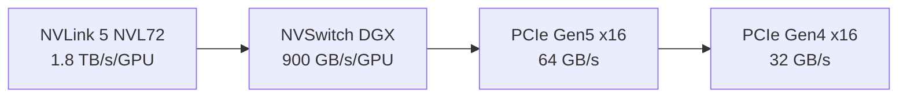

# 互连与并行

GPU 之间怎么通信，以及为什么这件事决定了 MoE 推理的性能上限。工作站 Blackwell 没有 NVLink，这是仅次于 SM ISA 分裂的第二大限制。

## 本节页面

- [`nvlink-vs-pcie`](nvlink-vs-pcie.md) —— 带宽、延迟与拓扑
- [`p2p-and-atomics`](p2p-and-atomics.md) —— P2P 特性与原子操作这道坎
- [`moe-parallelism`](moe-parallelism.md) —— TP、PP、EP 各自什么时候占优

## 关键数字

数据中心 NVLink 和消费级 PCIe 之间的带宽差距大约是 **30–55 倍**。对大多数 kernel（算力受限的稠密矩阵乘）来说这无关紧要——带宽是 GPU 之间的事，而计算发生在 GPU 内部。但对 MoE 的 all-to-all 来说，这就是决定性能的那个数字。

## 为什么对 MoE 很重要

一个有 N 个专家、top-k 路由的 MoE 层，每个 token 的数据流是：

1. 计算路由分数（很小）
2. 把 token 的隐状态 dispatch 到 k 个专家（专家在别的 GPU 上就意味着跨 GPU 发送）
3. 每个专家跑自己的 FFN
4. 把 k 个输出 combine 回 token 所在的 GPU（跨 GPU 接收）

在专家并行（EP）下，N 个专家分布在 N 张 GPU 上，第 2 步和第 4 步都是 **all-to-all** 操作，数据量随 `N × hidden_size × tokens_per_step` 增长。以 DeepSeek-V3 这类模型（N=256，hidden=7168，batch≈64）为例，每步的量在 **GB 量级**。

NVLink 上：all-to-all 微秒级完成。
PCIe 上：几百微秒到几毫秒。

对 decode（每步只产出 1 个 token）来说，这直接抬高了每 token 的延迟。吞吐会掉 30–50 倍。

## 为什么对非 MoE 模型无所谓

稠密模型（Llama、Mistral、GLM-4）做多 GPU 服务时**只用张量并行（TP）**。TP 每层只需要一次 `all_reduce`（不是 all-to-all），数据量也小得多（正比于序列长度，而不是词表大小）。PCIe Gen4 跑 TP 完全够用，几乎没有减速。

所以工作站 Blackwell 的"互连惩罚"是 **MoE 特有的**，不是普遍问题。

## 能做什么

三条路：

### 1. 彻底避开 all-to-all

用 TP+PP 代替 EP。每张 GPU 存全部专家（付出内存代价），但 all-to-all 变成了单 GPU 内部的一次置换。见 [`moe-parallelism`](moe-parallelism.md)。

### 2. 优化 all-to-all

用 NCCL 的 `all_to_all_single` 替代基于 NVSHMEM 的 one-shot 实现。比数据中心的最优路径慢，但绕开了原子操作这道坎。见 [`p2p-and-atomics`](p2p-and-atomics.md)。

### 3. 接受代价

有些场景（离线批量推理、低并发、模型小到整体吞吐够用）即便速度打折，EP 跑在 PCIe 上也能接受。

实践中，**大多数工作站 Blackwell 部署选的是第 1 条**——一方面架构上更干净，另一方面另外两条路各有各的坑。

## 阅读顺序

先看 [`nvlink-vs-pcie`](nvlink-vs-pcie.md) 了解拓扑数字；再看 [`p2p-and-atomics`](p2p-and-atomics.md)，弄清为什么"PCIe 比较慢"在某些情况下会变成"PCIe 根本跑不了"；最后看 [`moe-parallelism`](moe-parallelism.md)，看怎么绕着这个限制重新设计。
