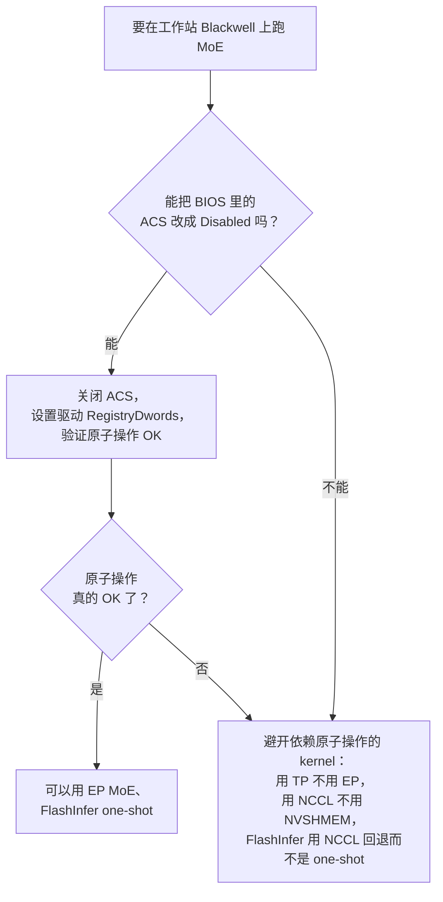

# P2P 与原子操作

GPU 之间的 peer-to-peer 显存访问，以及架在它之上的原子操作。原子操作这个问题，决定了 MoE all-to-all 到底是"慢"还是"根本跑不了"。

## "P2P" 是什么意思

P2P（peer-to-peer）GPU 显存访问，指的是一张 GPU **直接**读写另一张 GPU 的显存，不经过主机内存中转。

驱动会有选择地开启 P2P。检查方法：

```bash
nvidia-smi topo -p2p r          # 哪些 GPU 对可以做 P2P 读
nvidia-smi topo -p2p w          # 写
nvidia-smi topo -p2p a          # 原子操作
```

输出是一个矩阵，每个格子是下面几种之一：

- `OK` —— 支持且已开启
- `NS` —— Not Supported，不支持（硬件/驱动不允许）
- `X` —— 对角线（GPU 自己的显存）

## 三类操作

| 类别 | 做什么 | 延迟 | 用途 |
| --- | --- | --- | --- |
| **读（`p2p r`）** | GPU A 读 GPU B 的 HBM | 高，但可以接受 | 分布式推理的激活值、权重预取 |
| **写（`p2p w`）** | GPU A 写 GPU B 的 HBM | 和读差不多 | NCCL P2P 发送、NVSHMEM put |
| **原子操作（`p2p a`）** | GPU A 对 GPU B 的 HBM 做原子操作 | 最慢，需要特殊的硬件支持 | 完成标志、无锁同步、NVSHMEM signal/wait |

NVLink 上三种通常都支持而且很快。PCIe 上，消费级卡默认情况下**读写一般是 OK，原子操作通常是 NS**。

## 为什么原子操作特殊

一次 P2P 原子操作（比如对远端 GPU 显存做 `atomicAdd`）要求 PCIe fabric 和根复合体以一种普通读写不需要的方式**协调事务**。具体来说：

- 相对于同一地址的其他访问，原子操作必须是**不可分割**的
- fabric 必须把来自不同源的并发原子操作串行化
- 每个根复合体都必须实现 PCIe 的 AtomicOp 扩展

PCIe Gen3 加入了 `AtomicOp` 能力，Gen4 / Gen5 在此基础上延续。但**一条具体的 PCIe 路径是否真的支持 AtomicOp，取决于**：

- 两端（GPU 和根复合体）都声明支持
- 中间的 fabric（PCIe 交换芯片、根复合体路由）把它传递下去
- 驱动/固件**开启**了它（经常被当作"数据中心特性"锁住）

在消费级 GPU 上，NVIDIA **默认关闭** AtomicOp 支持——一部分是为了和数据中心产品拉开差距，一部分是因为消费级 SKU 的验证流程里不包含原子操作的校验。

## 在消费级 Blackwell 上开启原子操作

两项设置，缺一不可：

### 1. BIOS：关闭 ACS

ACS（Access Control Services，访问控制服务）是一项 PCIe 特性，**开启**时会把设备隔离到不同的 IOMMU 组里，并**阻断**跨组的 P2P 原子操作。

- ACS 开启 → 原子操作被阻断
- ACS 关闭 → 允许原子操作（在硬件能力范围内）

这个设置在主板 BIOS 里，通常是：

```
Advanced → AMD CBS → NBIO Common Options → ACS Enable: Disabled
```

（Intel 平台有对应项。各厂商叫法不同，找 "ACS" 这个关键字就行。）

有些工作站主板**不暴露**这个设置，或者暴露了但改了不生效（BIOS 的 bug）。服务器主板几乎都有。

### 2. 驱动：`RMDisableFeatureDisablement`

NVIDIA 驱动的一个 registry-dwords 设置，用来覆盖消费级卡对原子操作的封锁：

```
# 写在 /etc/modprobe.d/nvidia-unlock.conf 里：
options nvidia NVreg_RegistryDwords="RMDisableFeatureDisablement=1"
```

然后重新加载 nvidia 内核模块：

```bash
sudo systemctl stop docker.service
sudo modprobe -r nvidia_uvm nvidia_drm nvidia_modeset nvidia
sudo modprobe nvidia
sudo systemctl start docker.service
```

这会重新打开驱动出于产品分级而正常关闭的那些特性，包括硬件允许时的 P2P 原子操作。

## 验证原子操作

两项设置都做完后：

```bash
nvidia-smi topo -p2p a
```

如果非对角线的格子显示 `OK`，原子操作就可用了。如果两项都设了还是 `NS`，那是下面之一：

- BIOS 实际上没有把 ACS 关掉
- 主板的 PCIe 路由在那条路径上不支持 AtomicOp
- 驱动的 registry-dwords 没生效（用 `cat /proc/driver/nvidia/params | grep RegistryDwords` 确认）

## 什么时候原子操作重要

推理栈里有几个组件依赖 P2P 原子操作：

- **FlashInfer 的 MoE one-shot all-to-all** —— 忙等轮询由原子写更新的完成标志
- **NVSHMEM 的 signal/wait 配对** —— 同一模式的通用版本
- **一些自定义 MoE dispatch kernel** —— DeepEP 的各种变体、自定义 CUTLASS 模板
- **一些跨 GPU 共享 KV 的注意力 kernel** —— 少见，但某些实验性的栈里有

如果你在一个原子操作是 NS 的配置上跑上面任何一个，kernel 会**永远忙等下去**，看门狗在 60 秒时超时，服务崩溃。

报错长这样：

```
Rank 0 timed out waiting for completion flag from rank 1
Rank 1 timed out waiting for completion flag from rank 2
...
cudaFuncSetAttribute ... unspecified launch failure at cutlass_fused_moe_kernels.cuh:417
```

"completion flag"（完成标志）这个词就是线索——它是在忙等一个靠原子操作更新的标志。

## 什么时候原子操作无所谓

很多工作负载完全不需要原子操作：

- **NCCL 集合通信**（allreduce、allgather、all-to-all）用的是驻留在 SM 上的调度，不需要 P2P 原子操作
- **张量并行**在单个 TP 组内用的是 NCCL allreduce
- **流水线并行**用的是 NCCL 的 P2P send/recv
- **大多数注意力 kernel** 是单 GPU 的（KV cache 只在一个 rank 上）

如果你的推理栈只用 NCCL、不用 NVSHMEM 那种单边操作，原子操作是 NS 对你完全没影响。

## 一棵务实的决策树



实践中，"能改 BIOS 吗"的答案经常是"不能"——很多工作站主板不暴露 ACS 关闭选项，或者 BIOS 忽略这个设置。所以最常见的工作站 Blackwell 部署最终都落在"避开依赖原子操作的 kernel"这条分支上。

## 这道锁为什么存在

NVIDIA 的产品分级：PCIe 原子操作是"数据中心特性"，是你买数据中心 SKU 时付的钱的一部分。消费级卡被刻意限制，好让商业部署去用数据中心产品。

技术上的实现就是 `RMDisableFeatureDisablement`：一个运行时开关，用来翻转这个分级。它之所以存在，是因为验证基础设施在数据中心和消费级产品之间共用代码；打开开关就启用了数据中心的代码路径。

NVIDIA 并不正式"支持"在消费级卡上用这个开关，但研究和小规模部署中用得很广。某些原子操作模式能正常工作；另一些则有边角 bug，因为从来没在消费级硬件上测过。

## 小结

| 步骤 | 效果 |
| --- | --- |
| `nvidia-smi topo -p2p a` 显示 `NS` | 原子操作被阻断，MoE one-shot a2a 会失败 |
| BIOS：ACS 开启 | 原子操作被阻断的两个原因之一 |
| BIOS：ACS 关闭 | 解锁的前一半 |
| 驱动默认值 | 原子操作被阻断的第二个原因 |
| 驱动 `RMDisableFeatureDisablement=1` | 解锁的后一半 |
| 两项都设好 → `nvidia-smi topo -p2p a` 显示 `OK` | 原子操作已开启，MoE one-shot a2a 应该能跑 |
| 硬件物理上不支持 → 仍然 NS | 软件无解；用 NCCL 回退 |

## 另见

- [`nvlink-vs-pcie`](nvlink-vs-pcie.md) —— 带宽方面的背景
- [`moe-parallelism`](moe-parallelism.md) —— 原子操作不可用时该怎么办
- [`kernels/flashinfer`](../kernels/flashinfer.md) —— 最容易暴露这个问题的 kernel
- *PCIe Specification 4.0/5.0*，"AtomicOp" 扩展
- NVIDIA 开发者论坛上关于 `RMDisableFeatureDisablement` 的讨论帖
