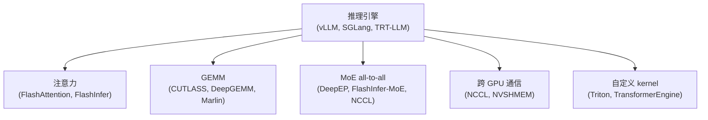

# Kernel 库

现代推理引擎是由一组 CUDA kernel 库拼装起来的。每个库都有自己的分工、自己在 Blackwell 时代的故事，以及在工作站 Blackwell 上各自特有的一套出错方式。

## 全景图

推理引擎本身并不实现 kernel，它们是调度者。每个请求要经过层层分发：框架 → kernel 库 → 特定架构的代码路径。"在 SM120 上能不能跑"这个问题，答案在最底层。

## 本节页面

- [`cutlass`](cutlass.md) — NVIDIA 的 GEMM 模板库
- [`flashattention`](flashattention.md) — FA-2 / FA-3 家族
- [`flashinfer`](flashinfer.md) — 面向服务场景的注意力 + MoE
- [`deepgemm`](deepgemm.md) — DeepSeek 的高吞吐 FP8/FP4 GEMM
- [`marlin-and-friends`](marlin-and-friends.md) — INT4 路径（Marlin、AWQ、GPTQ）
- [`triton-and-transformerengine`](triton-and-transformerengine.md) — DSL 写的 kernel 和 NVIDIA 的混合精度封装
- [`nvshmem-and-deepep`](nvshmem-and-deepep.md) — MoE 用的通信原语
- [`inference-engines`](inference-engines.md) — vLLM、SGLang、TRT-LLM 作为 kernel 的拼装者

## 怎么读本节

每个库的页面都按同一个模板组织：

1. **是什么** — 用途、谁在维护
2. **依赖什么** — 它在整个栈里的位置
3. **SM100 的情况** — 数据中心版 Blackwell 是如何被支持的
4. **SM120 的情况** — 什么能用、什么不能用、什么被门槛卡住了
5. **常见故障** — 用户实际会碰到的具体报错
6. **检测方法** — 怎么判断一个二进制用了这个库、编译目标是哪个架构
7. **参考资料** — 进一步阅读的去处

如果你是想搞清楚某个具体故障（"FlashInfer 的 MoE all-to-all 为什么跑不起来？"），找到对应库的页面，读第 4–5 节即可。

## 兼容性总览

各个库所处位置的鸟瞰图：

| 库 | SM100 状态 | SM120 状态 | 备注 |
| --- | --- | --- | --- |
| CUTLASS | 完整支持，有 `sm_100a` 模板 | 部分支持，有 `sm_120` 模板；SMEM 断崖是主要的坑 | NVIDIA 维护 |
| FlashAttention 2 | 可用 | 可用（FA-2 可移植） | Tri Dao，MIT 协议 |
| FlashAttention 3 | 可用（按 Hopper 扩展方式） | 尚不可用 — Blackwell 移植进行中 | |
| FlashInfer | 完整支持 | 部分支持 — NVFP4 没问题，MoE one-shot a2a 需要 P2P 原子操作 | |
| DeepGEMM | 完整支持 | 发布版本不支持，移植进行中 | DeepSeek-AI |
| Marlin | 不是最优路径 | 正常可用；架构较老，支持面广 | |
| Triton | 可用 | 可用 | DSL 编译器 — 大多数 kernel 可移植 |
| TransformerEngine | NVIDIA 的参考实现 | 持续演进中 | NVIDIA 维护 |
| NVSHMEM | 性能依赖 NVLink | 没有 NVLink 慢到没法用 | NVIDIA |
| DeepEP 节点内 | 需要 NVLink + NVSHMEM | 跑不起来 | DeepSeek-AI |
| DeepEP 节点间 | 需要 RDMA 网卡 | 跑不起来 | |
| vLLM | 可用 | 非 DSA 模型可用；DSA 需要 SM120 修复 | |
| SGLang | 可用 | 可用（特定版本，需打补丁） | |
| TensorRT-LLM | 可用 | 在 SM120 上能构建；预编译 engine 的目标是 SM100 | NVIDIA |

规律是：**凡是 NVIDIA 针对数据中心版 Blackwell 编译的东西，默认目标都是 `sm_100a`，而且只带这一个目标。**要支持工作站 Blackwell，要么重新编译，要么用专门面向 SM120 的变体。

## 为什么有这么多库？

这是个合理的疑问。碎片化的背后是不同的优化领域：

- **注意力和 GEMM** 是两个不同的问题，最优的 kernel 结构也不同（不规则稀疏 vs 稠密矩阵乘）
- **MoE all-to-all** 是*通信*原语，不是计算原语
- **量化**（NVFP4 vs MX-FP4 vs INT4）会大幅改变 kernel 的内层循环
- **不同架构**（SM80、SM90、SM100、SM120）各自需要不同的 tile 形状和流水线

这几个维度组合起来，就产生了约 10 个互相独立的库，各由不同团队维护。上层的推理引擎则要承担一件吃力不讨好的活：为每个模型的每一层选出正确的那一个。

## 关于版本的说明

这些库变化很快，大多每 2–4 周就出一个新版本。本节各页面记录的具体行为，锚定在 2026 年初的当前版本：

- CUTLASS 3.6.x
- FlashAttention 2.7.x，FA-3 开发中
- FlashInfer 0.6.x – 0.7.x
- DeepGEMM 以 `deepseek-ai/DeepGEMM` main 分支为准
- vLLM 0.7.x
- SGLang 0.5.x
- TensorRT-LLM 0.18.x

如果你在 2026 年中或更晚读到这些内容，具体的 commit 哈希和版本号大概率已经变了。但架构层面的事实（哪个库用 `tcgen05`、哪个库需要 P2P 原子操作）比版本号变得慢得多。
