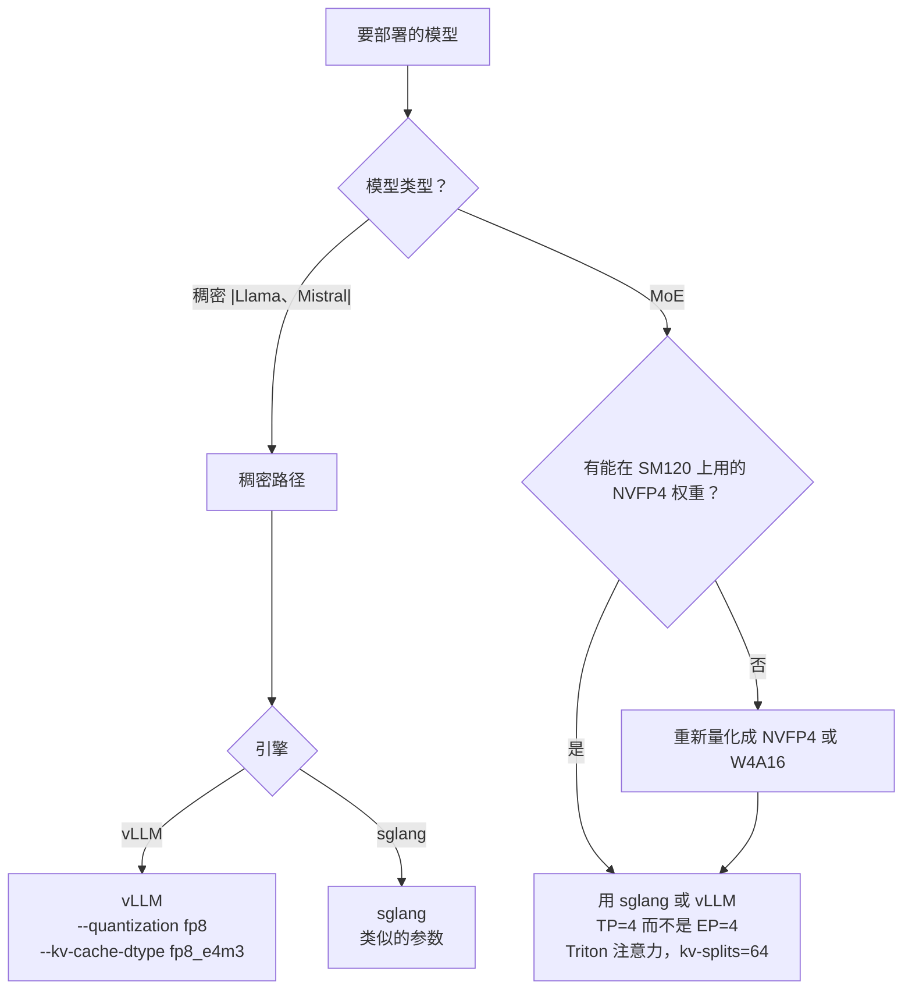

# 推理引擎：vLLM、SGLang、TensorRT-LLM

它们是 kernel 库之上的调度者：接收一个模型和一个请求，决定每一层由哪个 kernel 来跑。理解它们的 dispatch 逻辑，就能理解某次推理调用最终会碰到哪个底层 kernel。

## 推理引擎做什么

按大致的执行顺序：

1. **加载权重**：从磁盘读到 GPU 内存，同时套用并行方案（TP/PP/EP）
2. **分配 KV cache**（分页注意力布局，fp8 或 bf16，启动时选定）
3. **监听** HTTP / gRPC API
4. **把请求调度成 batch**（连续批处理、基数树缓存等）
5. **dispatch** 每次前向传播，逐层走过 kernel 流水线
6. **流式返回**输出 token

"dispatch"这一步是架构起作用的地方：引擎要为每一层挑一个注意力 kernel（FlashAttention、FlashInfer 或某个 Triton kernel）、一个 GEMM kernel（CUTLASS、DeepGEMM、Marlin 或自定义路径）和一个 MoE kernel（FlashInfer-MoE、DeepEP 或 NCCL 回退）。

## vLLM

GitHub：`vllm-project/vllm`。协议：Apache-2.0。最初来自 UC Berkeley，现在由社区和 Anyscale 维护。

### 特色

- **PagedAttention**：开创了如今已成标准的分页注意力 KV cache 布局
- **连续批处理**：业界领先的调度器
- **模型支持广**：新模型架构出来几天内就能跟上

### 在 SM120 上

vLLM 的大部分功能在工作站 Blackwell 上可用。例外：

- **使用 DSA（Differential Sparse Attention）的模型**，尤其是某些 GLM-5 变体，会碰到一个在 SM120 上编译不过的 kernel。有一个 open issue，修复 PR 已并入 vLLM 0.7.x。
- **部分 MoE 路径**会走 FlashInfer 的 MoE kernel，可能撞上原子操作这道坎。

对大多数不用 DSA、不用 MoE EP 的模型，vLLM 在 SM120 上配好参数就能直接跑。

### SM120 关键参数

```bash
# 关掉跑不通的 kernel 路径
--quantization modelopt_fp4      # 用 NVFP4（CUTLASS 路径）
--kv-cache-dtype fp8_e4m3        # 紧凑的 KV
--enforce-eager                  # CUDA graph 捕获失败时跳过它

# 张量并行，不用专家并行
--tensor-parallel-size 4
--pipeline-parallel-size 1
```

## SGLang

GitHub：`sgl-project/sglang`。协议：Apache-2.0。最初来自 LMSYS / UC Berkeley，社区维护。

### 特色

- **RadixAttention**：跨请求的激进前缀缓存
- **前端 DSL**：可编程推理（控制流、结构化输出）
- **专注 MoE**：MoE 服务方面较好的引擎之一

### 在 SM120 上

SGLang 从 0.5.10+ 起明确支持 SM120。支持：

- 通过 FlashInfer + CUTLASS 使用 NVFP4 权重
- 通过 FlashInfer 的 KV 注意力使用 FP8 KV cache
- 基于 Triton、带 KV 切分的注意力（SM120 上的长上下文快速路径）
- TP=4 的 MoE，不调用 EP 类 kernel

### SM120 关键参数

```bash
# 对这个架构友好的设置
--quantization modelopt_fp4
--kv-cache-dtype fp8_e4m3
--attention-backend auto         # 让 sglang 在 SM120 上自动选 Triton
--triton-attention-num-kv-splits 64   # 影响最大的旋钮

# 并行方案
--tensor-parallel-size 4

# 性能旋钮
--mem-fraction-static 0.94
--page-size 128                  # 开了 MTP 就用 64
```

### SGLang 的环境变量

```bash
SGLANG_ENABLE_DEEP_GEMM=0        # 截至 2026 年初 DeepGEMM 只支持 SM100
SGLANG_DISABLE_DEEP_GEMM=1
SGLANG_ENABLE_JIT_DEEPGEMM=0
SGLANG_PYNCCL_SKIP_WARMUP=1      # 避免 PCIe 上 TP=4 预热死锁
```

这些是双保险：告诉 sglang 跳过那些已知只适用于 SM100 的 kernel 路径。

## TensorRT-LLM

GitHub：`NVIDIA/TensorRT-LLM`。协议：Apache-2.0。由 NVIDIA 维护。

### 特色

- **较小模型（70B 参数以下）上吞吐最高**；提前编译成 TensorRT engine
- **NVIDIA 官方背书，对 CUTLASS 模板的使用最激进**
- 在 Hopper / SM100 上 **FP8 推理是业内最好的**

### 在 SM120 上

TRT-LLM "理论上"支持 SM120，但发布的预编译 engine 针对的是 `sm_100a`。要在 SM120 上跑，通常得：

1. 用 `--target-arch sm_120` 从源码构建 TRT-LLM
2. 在 SM120 设备上把模型编译成 TensorRT engine（engine 不能跨架构移植）

这足够麻烦，以至于大多数工作站 Blackwell 用户直接跳过 TRT-LLM，改用 vLLM 或 sglang。反正 TRT-LLM 的优势（Hopper 上的峰值吞吐）到了 SM120 上也体现不出来。

### 什么情况下还是会选 TRT-LLM

- 需要 NVIDIA 认证的部署（例如客户要求 NVIDIA 验证）
- 某个 kernel 只在 TRT-LLM 里有，别处还没移植
- 本来就熟悉 TensorRT 工具链

## SM120 部署决策树



主流套路：**只用 TP 并行**、**NVFP4 权重**、**FP8 KV cache**、**Triton 注意力配高 kv-splits**、**关掉 DeepGEMM 改用 CUTLASS**。

## 各引擎共有的常见故障

不管在 SM120 上选哪个引擎，这些都会出现：

1. **`no kernel image is available`**——kernel 库只带了 `sm_100a` 的 cubin。重新安装出问题的那个库（FlashInfer、DeepGEMM 等）的 SM120 版本。

2. **TP=4 时 NCCL 预热死锁**——引擎分布式初始化里的 NCCL 预热阶段在跨根复合体 P2P 上死锁。修法：`SGLANG_PYNCCL_SKIP_WARMUP=1`（sglang）或 `VLLM_DISABLE_NCCL_WARMUP=1`（vLLM，在支持的版本上）。

3. **MoE all-to-all 超时**——见 [`flashinfer`](flashinfer.md) 和 [`nvshmem-and-deepep`](nvshmem-and-deepep.md)。修法在并行方案层面：从 EP 换成 TP。

4. **长上下文下输出是乱码**——多半是 kv-splits 还是默认值（8）。设成 `triton-attention-num-kv-splits=64`。

5. **长 prompt 的 prefill 阶段 OOM**——`mem-fraction-static` 设得太激进（>0.95）。降到 0.94 或 0.92。

## 引擎版本锁定

上面记录的具体行为对应的是截至 2026 年初的版本：

- vLLM 0.7.x
- SGLang 0.5.10–0.5.11
- TensorRT-LLM 0.18.x

更新或更旧的版本行为可能不同。在假定某个参数还和本 wiki 说的一样之前，先查发布说明。

## 另见

- [`flashinfer`](flashinfer.md)、[`flashattention`](flashattention.md)、[`cutlass`](cutlass.md)——引擎调用的底层库
- [`compatibility/`](../compatibility/index.md)——让东西跑起来的套路
- [`case-studies/`](../case-studies/index.md)——针对具体模型的部署配方
- *Kwon et al., "Efficient Memory Management for Large Language Model Serving with PagedAttention"*（vLLM，2023）
- *Zheng et al., "SGLang: Efficient Execution of Structured Language Model Programs"*（2024）
- vLLM、SGLang、TRT-LLM 项目文档
