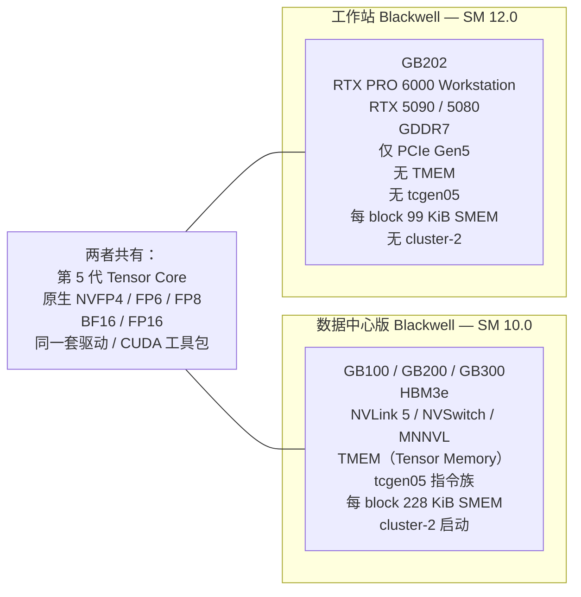

# 全景图

一页纸讲清本 wiki 里所有概念之间的关系。如果你只打算读一页，就读这一页。

## 核心论断

> "Blackwell" 这一代包含**两种截然不同的架构**，它们共用一个品牌名、同一代 Tensor Core，除此之外在 kernel 层面几乎没有任何要紧的共同点。

Tensor Core 一样，驱动它们的接口却不一样。这个分裂不是渐进的，而是在 ISA 层面非黑即白。不存在什么"兼容模式"。

## 五个后果，由浅入深

### 1. 面向 SM100 的 cubin 在 SM120 上拒绝运行

最显而易见的一条。`.cubin` 文件（编译好的 CUDA 二进制）内嵌了目标架构。驱动在启动前会检查架构。SM 10.0 的二进制在 SM 12.0 上加载失败，报一个干净利落的错误。大多数用户最先撞上的就是这个。

### 2. 为 SM100 编译的 PTX 在 SM120 上汇编失败

再深一层。PTX（Parallel Thread eXecution）是中间表示。含有 `tcgen05.*` 指令或 TMEM 操作的 PTX 无法被 `ptxas` 汇编到 `sm_120`——直接报错。所以只要 PTX 本身用了数据中心专属指令，"从 PTX 做 JIT"这条路也救不了你。

### 3. 与 SM120 兼容的 PTX 仍会撞上 SMEM 断崖

更隐蔽。很多 CUTLASS 模板在两个目标上都能干净地编译通过，但会申请**每 block 228 KiB 共享内存**，正好贴着数据中心版 Blackwell 的上限。而 SM120 上每 block 的上限是 **99 KiB**。kernel 照样能启动——但多申请的那部分 SMEM 会悄悄破坏相邻的 bank，输出全零或乱码，没有任何错误码。

### 4. NVLink 换成 PCIe，MoE 吞吐暴跌 30–50 倍

和 SM ISA 完全无关的一条。NVLink 5 提供每 GPU 约 1.8 TB/s；消费级 PCIe 每对 GPU 只有 32–64 GB/s。围绕专家并行（EP）设计的 MoE 推理方案，每个 token 步都要发一次 all-to-all。在 NVLink 上这是微秒级的事；在 PCIe 上它成了推理的头号开销。解决办法不是换个新 kernel，而是换一套并行方案（用 TP+PP 代替 EP）。

### 5. 消费级卡上 P2P 原子操作被软件锁住

最隐蔽的一条。消费级驱动默认关闭跨 GPU 的 PCIe 原子操作。很多"现代"MoE all-to-all kernel（FlashInfer one-shot、MNNVL）靠忙等轮询跨 rank 的原子完成标志来同步。原子操作被锁住之后，轮询的那个 rank 永远看不到标志——操作永远完不成——看门狗把服务进程杀掉。要打开原子操作，既需要 BIOS 选项（ACS Disabled），也需要驱动的注册表开关。

## 本 wiki 的阅读顺序

这张图对应侧边栏的顺序。上面每个后果都对应一个或多个深入讲解的页面：

| 后果 | 读这些页面 |
| --- | --- |
| 1 + 2：ISA 不匹配 | [`fundamentals/cuda-pipeline`](../fundamentals/cuda-pipeline.md)、[`blackwell/sm100-vs-sm120`](../blackwell/sm100-vs-sm120.md)、[`blackwell/tcgen05-and-tmem`](../blackwell/tcgen05-and-tmem.md) |
| 3：SMEM 断崖 | [`fundamentals/memory-hierarchy`](../fundamentals/memory-hierarchy.md)、[`blackwell/sm100-vs-sm120`](../blackwell/sm100-vs-sm120.md)、[`kernels/cutlass`](../kernels/cutlass.md) |
| 4：MoE 吞吐暴跌 | [`interconnect/nvlink-vs-pcie`](../interconnect/nvlink-vs-pcie.md)、[`interconnect/moe-parallelism`](../interconnect/moe-parallelism.md) |
| 5：原子操作 | [`interconnect/p2p-and-atomics`](../interconnect/p2p-and-atomics.md)、[`kernels/flashinfer`](../kernels/flashinfer.md) |
| 综合 | [`case-studies/`](../case-studies/index.md)（每个模型一页） |
| 该怎么办 | [`compatibility/`](../compatibility/index.md)（翻译套路、方案重写） |

## 哪些能跑：一个分类法

对每个模型家族，三个问题决定了它能不能在消费级 Blackwell 上跑：

1. **模型的参考推理栈是否用了 SM100 专属指令？**（例如 DeepGEMM、FlashInfer 的 NVFP4 路径、任何为 `sm_100a` 编译的东西。）是，就得换用替代 kernel。
2. **并行方案是否假设了 NVLink 级别的 all-to-all？**（例如在 NVLink + NVSHMEM 上跑 EP=N。）是，就得把方案重写成 TP+PP。
3. **是否有 kernel 靠 P2P 原子操作忙等轮询？**（例如 FlashInfer one-shot a2a。）是，就得打开原子操作，或者换一个 a2a kernel。

每一个"是"都对应案例分析里的一章。

## 本 wiki 在技术版图上的位置

覆盖的范围：

- **硬件**（芯片、板卡、互连）——只讲到它对软件构成约束的程度
- **驱动 + CUDA 运行时**——只讲到它暴露 SM 版本差异的程度
- **PTX + cubin 编译流程**——在 [`fundamentals/cuda-pipeline`](../fundamentals/cuda-pipeline.md) 中讲
- **内核库**——[`kernels/`](../kernels/index.md) 的主体
- **推理引擎**（vLLM、sglang、TRT-LLM）——当作内核库的组合者来讲，不深入框架内部
- **模型**（架构、注意力变体、MoE 路由）——在 [`case-studies/`](../case-studies/index.md) 中从"它们假设了什么"的角度讲

本 wiki 位于**内核库及以下**这一层。它不教你怎么写 transformer，也不教你怎么微调。它讲的是 NVIDIA 在 Blackwell 上给这些东西垫了什么底，以及 NVIDIA 之上的各家厂商在哪些地方走了捷径、而这些捷径只伤害了这一代的其中一半。

## 词汇预览

三个每页都会出现的术语：

- **计算能力**（compute capability，"CC"）——SM 版本号对，例如 `7.0`、`8.0`、`9.0`、`10.0`、`12.0`。小数点前的数字是**主版本号**；小数点后的数字是**次版本号**（译注：原文把两者写反了，已改）。主版本号相同 = ISA 相关；主版本号不同 = 可能不兼容。
- **`sm_100` / `sm_120` / `sm_100a` / `sm_120f`**——编译器标志用的小写形式。不带后缀的 `sm_NN` 就是架构本身。后缀 `a` 表示"架构专属加速"（使用不可移植的特性）。后缀 `f` 表示"向前兼容"（只使用可移植的特性）。
- **NVFP4**——NVIDIA 版的 OCP MX-FP4：4 位元素每 16 个一组，每组配一个 FP8（E4M3）缩放因子。在 SM100 和 SM120 上**都是**原生支持——少数在两边行为真正一致的特性之一。

完整列表见[术语表](glossary.md)。

## 下一步去哪

- 对 GPU 编程整体还不熟？从 [`fundamentals/index`](../fundamentals/index.md) 开始。
- CUDA 用得顺手，想听 Blackwell 的故事？跳到 [`blackwell/index`](../blackwell/index.md)。
- 手头正好有个模型跑不起来？在 [`case-studies/index`](../case-studies/index.md) 里找它。
