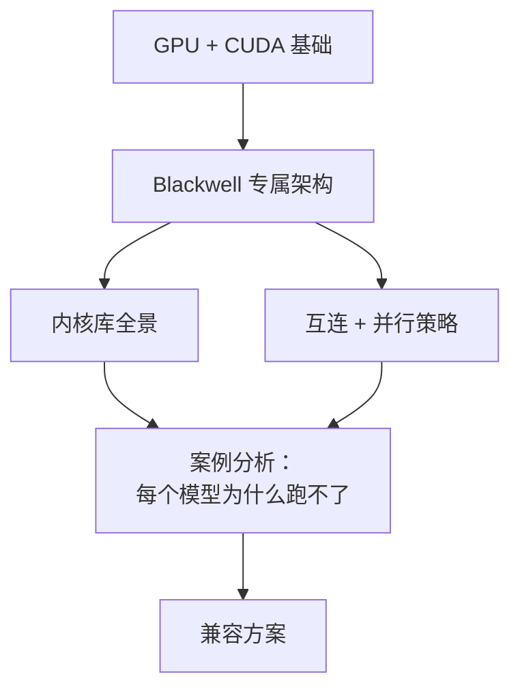

# Blackwell 消费级 vs 数据中心版 wiki

这是一份独立的、面向学习的参考资料，用来理解 NVIDIA Blackwell 这一代——具体说，是 **SM 10.0**（数据中心版 Blackwell，GB100/GB200/GB300）和 **SM 12.0**（工作站/消费级 Blackwell，GB202：RTX PRO 6000 Workstation、RTX 5090 等）之间的架构分裂。

之所以写这份 wiki，是因为当下的开放权重模型推理栈（DeepSeek-V3/V4、Kimi-K2、GLM-5.x、Qwen-3-MoE）几乎完全是按数据中心版 Blackwell 的假设搭出来的：NVLink、Tensor Memory（TMEM）、`tcgen05` 指令、228 KiB 的共享内存上限、MNNVL fabric、P2P 原子操作。消费级 Blackwell 与它同名、同一代 Tensor Core，但**并不**共享那套 ISA 和互连能力。为其中一方写的软件在另一方上会以微妙但有明确规律的方式失败。

如果你手里有一张工作站 Blackwell 卡，并且问过"这东西为什么跑不起来？"——这份 wiki 就是答案。

## 这份 wiki 讲什么

- **基础篇**：GPU 执行模型、内存层级、CUDA 编译流程、Tensor Core、数值格式。读懂本 wiki 其余部分所需的最少背景。
- **Blackwell**：SM100 与 SM120 的详细对比。`tcgen05`、TMEM、cluster-2 启动、99 KiB 共享内存断崖、NVFP4。
- **内核库**：CUTLASS、FlashAttention、FlashInfer、DeepGEMM、vLLM、SGLang、TensorRT-LLM、Marlin、Triton、TransformerEngine、NVSHMEM。每个库是干什么的，SM100 与 SM120 支持在哪里分道扬镳，以及怎么从它们的 issue 列表里读出兼容性线索。
- **互连**：NVLink、NVSwitch 与 PCIe 的对比。MoE 的 all-to-all 为什么受带宽和原子操作双重制约。EP 与 TP 之间的取舍。
- **案例分析**：DeepSeek-V3/V4-Flash、Kimi-K2.x、GLM-5.x。逐个分析模型及其参考部署方案做了哪些假设，其中哪些在工作站 Blackwell 上不成立。
- **兼容方案**：如何把 SM100 kernel 翻译到 SM120，如何为没有 NVLink 的拓扑重写 EP 方案，如何在运行时检测拓扑不匹配。讲的是通用技巧，不绑定某个具体实现。
- **参考资料**：术语表、缩写表、环境变量速查表、参考文献。

## 这份 wiki 不讲什么

- **训练。** 只讲推理。训练有自己的一套问题（梯度通信、混合精度优化器、故障恢复），与本文无关。
- **多节点。** 只讲单节点。一旦跨过网络边界，互连这部分的故事会大不一样。
- **Hopper、Ampere 或更早的架构。** 会拿来做对比，但不是重点。
- **AMD、Intel 或其他非 NVIDIA GPU。** 内核库和 ISA 这部分内容是 NVIDIA 专属的。
- **具体商业产品或购买建议。** 这是技术资料，不是推荐清单。

## 读者

这份 wiki 面向三类读者，按受益程度从高到低排列：

1. **手里有工作站 Blackwell 卡的 ML 工程师**，想搞清楚为什么某前沿实验室发布的模型 X 跑不起来，或者只能跑到"理论上应有"吞吐的 5%。建议从头到尾通读。
2. **在数据中心版和消费级 Blackwell 之间移植 kernel 的 CUDA 开发者**。直接跳到 [`blackwell/`](../blackwell/index.md) 和 [`kernels/`](../kernels/index.md)。
3. **系统研究者或好奇的读者**，想理解 Blackwell 这一代的分界线上发生了什么，"同一个架构"为什么会产出两套不同的 ISA。案例分析是最有意思的部分。

## 怎么读

推荐三条阅读路线：

**顺序通读（约 3–4 小时）：** 从 `fundamentals/index.md` 开始，按侧边栏顺序把每一页读完。读完之后，你就能不查术语表读懂 CUTLASS issue 里的讨论。

**自顶向下（约 1 小时）：** 读完本概览，再读 [`overview/architecture`](architecture.md)（一页纸的全景图），然后直接跳到你真正关心的那个模型的案例分析，缺什么前置知识再回头补。

**查阅（每次约 5 分钟）：** 把[术语表](glossary.md)、[缩写表](../reference/abbreviations.md)和[参考资料索引](../reference/index.md)当 man page 用。每个术语表词条都链接到深入讲解该术语的页面。

## 相关资源

这份 wiki 有意做成自包含的：每个论断要么在页面内解释清楚，要么在术语表里有定义，要么在参考文献里有出处。需要向外引用时，指向的是：

- NVIDIA PTX ISA 规范（原文引用 8.3–8.5；`tcgen05` 自 8.6 起，译文按 9.3 核对）
- NVIDIA Blackwell 白皮书
- CUTLASS、FlashInfer、DeepGEMM、sglang、vLLM 的源码仓库和 issue 列表
- OCP 微缩放（MX）格式规范，定义 FP4/FP6/FP8 的数值布局
- [`reference/bibliography`](../reference/bibliography.md) 中引用的学术论文

## 关于时效

本 wiki 反映的是 2026 年初开源 GPU 推理生态的状态。具体的内核库版本号（CUTLASS 3.x、sglang 0.5.x、FlashInfer 0.6.x）和 PTX ISA 版本（原文按 8.5；译文按 2026 年 9 月的 9.3 核对）在正文中要紧的地方都已固定标明。凡是写着"截至 2026 年"的内容，都请当作一个快照，而不是永久成立的事实——这些库每隔几周就会变。
