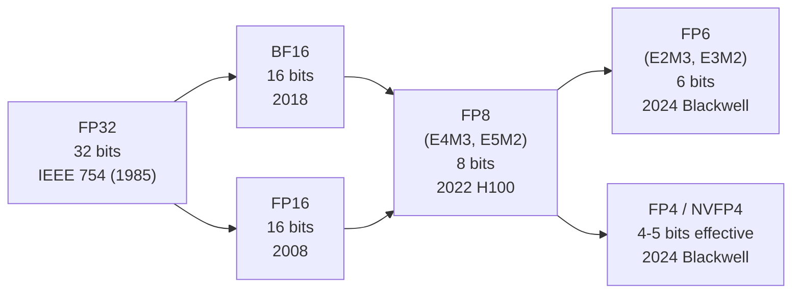

# Number formats

The encoding of every number a Tensor Core multiplies. The diversity of formats is the dominant story of the Hopper-and-Blackwell era.

## The bit-width story



Each generation of formats roughly **halves storage** while retaining usable accuracy for ML workloads. The trick is increasingly aggressive **scaling**: as bit-width drops, dynamic range becomes the bottleneck, so formats partition values into blocks with per-block scale factors.

## Floating-point format crash course

A floating-point number is `(sign)(2^exponent)(1.mantissa)`, with bias on the exponent. The encoding is **1 + E + M bits** where E is exponent bits and M is mantissa bits. More E → wider range; more M → finer precision.

| Format | Bits | E | M | Range (approx) | Precision (approx) |
| --- | ---: | ---: | ---: | --- | --- |
| FP32 (IEEE 754) | 32 | 8 | 23 | ±10⁻³⁸ to ±10³⁸ | ~7 decimal digits |
| TF32 (Tensor Core internal) | 19 | 8 | 10 | ±10⁻³⁸ to ±10³⁸ | ~3 decimal digits |
| FP16 (IEEE 754 binary16) | 16 | 5 | 10 | ±6×10⁻⁵ to ±65 504 | ~3 digits |
| BF16 (Brain float) | 16 | 8 | 7 | ±10⁻³⁸ to ±10³⁸ | ~2 digits |
| FP8 E4M3 | 8 | 4 | 3 | ±2⁻⁹ to ±448 | ~1.3 digits |
| FP8 E5M2 | 8 | 5 | 2 | ±2⁻¹⁶ to ±57 344 | ~1 digit |
| FP6 E2M3 | 6 | 2 | 3 | ±0.0625 to ±7.5 | ~1 digit |
| FP6 E3M2 | 6 | 3 | 2 | ±10⁻³ to ±28 | <1 digit |
| FP4 E2M1 | 4 | 2 | 1 | ±0.5 to ±6 | <1 digit |

A few patterns:

- **BF16 vs FP16**: same bit count, different split. BF16 trades precision for range — the same exponent range as FP32 means no loss-of-scale issues mid-training. ML quickly standardized on BF16 for training over FP16 for this reason.
- **FP8 E4M3 vs E5M2**: the E5M2 variant has wider range, used for gradients in training. E4M3 has more precision, used for activations and weights in inference.
- **FP6 and FP4**: dynamic range becomes laughably small. These formats are useful **only** in block-quantized form with a per-block scale.

## Block-quantized formats

For sub-8-bit formats, the value alone doesn't carry enough range. So the format pairs each value with a **scale factor** shared across a block of values:

```
Block of 16 elements      |  Scale (1 element)
[v0 v1 v2 ... v15]        |  s
                          ▼
True value of v_i = v_i * s
```

Different formats differ in:

- **Block size** (how many values share one scale)
- **Scale type** (what format the scale itself uses)
- **Scale alignment** (where in memory the scale sits relative to the values)

### MX-FP4 (Open Compute Project Microscaling)

The OCP-standardized block FP4 format:

- **Block size**: 32 elements
- **Scale type**: E8M0 (8-bit, exponent-only — every scale is a power of two)
- **Layout**: 32 elements (16 bytes packed) + 1 scale (1 byte)
- **Effective bits/element**: 32×4/32 + 8/32 = 4.25 bits

Adopted by AMD, Intel, ARM, and others as a multi-vendor standard.

### NVFP4 (NVIDIA's variant)

NVIDIA's variant tightens both:

- **Block size**: 16 elements (smaller → better dynamic-range tracking per region of the tensor)
- **Scale type**: FP8 (E4M3) (more scale precision)
- **Layout**: 16 elements (8 bytes packed) + 1 scale (1 byte)
- **Effective bits/element**: 16×4/16 + 8/16 ≈ 4.5 bits

Slightly more storage than MX-FP4 (~4.5 vs ~4.25 bits/element), but better accuracy in practice on ML workloads — the smaller block size means tensors with non-uniform ranges (e.g., per-channel outliers) get tighter scales.

**Crucially: native on both SM100 and SM120 Tensor Cores.** This is the rare format that genuinely works the same on both halves of Blackwell.

### Why two FP4 formats coexist

NVIDIA owns NVFP4 and ships hardware that natively supports it. The OCP MX-FP4 standard exists because the broader industry didn't want to be locked to NVIDIA's spec. Some libraries (DeepGEMM) ship both NVFP4 and MX-FP4 paths; some (CUTLASS) prefer NVFP4 on NVIDIA hardware.

A common bug: a library compiled with the MX-FP4 path but loaded weights stored in NVFP4 format. The scale layout differs, so the kernel reads 16-element E4M3 scales as if they were 32-element E8M0 scales, producing nonsense outputs without erroring.

## When each format is used

A typical inference deployment of a modern MoE model uses **multiple formats simultaneously**:

| Use | Common format |
| --- | --- |
| Model weights | NVFP4 (~4.5 bit/elem) |
| KV cache | FP8 E4M3 |
| Activations during prefill | BF16 or FP8 |
| Activations during decode | BF16 |
| Tensor Core accumulator | FP32 |
| LayerNorm / softmax | FP32 |
| Attention scores | FP16 or BF16 |
| Final logits | FP32 |

The Tensor Cores can multiply low-precision inputs into a high-precision accumulator in a single instruction. So the heavy GEMMs run at NVFP4-input/FP32-accum throughput, while sensitive operations (norm, softmax) stay at FP32.

## The conversion problem

Real inference involves **continuous conversion** between formats. A typical layer's data flow:

```
Weights (NVFP4 in HBM)
     │ load + dequantize
     ▼
Operand A (BF16 in registers)
     │ Tensor Core MMA (BF16 input, FP32 accum)
     ▼
Result (FP32 in TMEM/registers)
     │ activation function (FP32)
     ▼
Activation (BF16 in registers)
     │ store + quantize
     ▼
Activation (FP8 in HBM, for KV cache)
```

Each conversion is a kernel responsibility. Bugs in conversion paths are common — and architecture-specific. On both halves the block-scaled MMA dequantizes inside the Tensor Core (`tcgen05.mma.kind::mxf4nvf4` on SM100, block-scaled `mma.sync` on SM120), so there is no separate dequantization instruction; only a plain MMA without block scaling needs a software dequantization to FP8/BF16 first.

## Block-scaled MMA details on Blackwell (SM100)

The above is about the formats themselves; how `tcgen05` consumes them has a few hard rules:

| MMA kind | Elements | K | Scale | `scale_vec` |
| --- | --- | --- | --- | --- |
| `kind::mxf8f6f4` | mixed FP8 / FP6 / FP4 | 32 | UE8M0, blocks of 32 | `1X` |
| `kind::mxf4` | FP4 | 64 | UE8M0, blocks of 32 | `2X` |
| `kind::mxf4nvf4` | FP4 | 64 | UE8M0 (blocks of 32) or UE4M3 (blocks of 16, i.e. NVFP4) | `2X` / `4X` (also spelled `.block32` / `.block16` from 12.9) |

- **Scales must live in TMEM**, replicated into all four 32-lane partitions; one 32-bit TMEM word holds at most 4 scales of the same row. They get there via `tcgen05.cp` from SMEM.
- The GMEM / SMEM scale layout CUTLASS defines is a fixed 512-byte basic block (128 rows × 4 scales along K); cuBLAS uses the same layout and notes that it "does not allow transposition". Use it in your own kernels rather than inventing another.
- In `kind::f8f6f4` / `mxf8f6f4` every 4- and 6-bit element **occupies its own 8-bit container**, and A and B may mix any of the five types; only `kind::mxf4 / mxf4nvf4` are truly packed two per byte. The matching TMA unpack formats are `.b4x16_p64` and `.b6x16_p32`.
- NVFP4's per-tensor FP32 scale is a software convention, not part of the MMA instruction; the block scale UE4M3 is an unsigned E4M3.
- INT8 stays (`kind::i8`, `sm_100a` only); **INT4 does not exist in either `tcgen05` or `wgmma`** — INT4 weights either go through a Marlin-style dequantization path or get converted to FP4.
- Conversions: `cvt.rn.satfinite.{e2m1x2, e2m3x2, e3m2x2, ue8m0x2}.f32` (PTX 8.6); there is no cvt to UE4M3. Headers `cuda_fp4.h` (`__nv_fp4_e2m1`), `cuda_fp6.h` and `__nv_fp8_e8m0` ship with CUDA 12.8. Known 12.8 issue: the C++ conversion constructors only implement round-toward-zero — do not use them for MX formats.
- cuBLASLt supports block scaling from 12.8: `CUBLASLT_MATMUL_MATRIX_SCALE_VEC16_UE4M3` (NVFP4), `VEC32_UE8M0` (MXFP8), with data types `CUDA_R_4F_E2M1`, `CUDA_R_8F_UE8M0`, `CUDA_R_8F_UE4M3`. cuBLASLt does not do FP6.

## FP8 accumulation precision: Hopper and Blackwell differ

Hopper's FP8 Tensor Core keeps only about 13 to 14 mantissa bits while accumulating (measured in the DeepSeek-V3 technical report and on the PyTorch blog), which is why DeepGEMM on Hopper moves the partial sum back to CUDA cores every 128 K for a true FP32 add ("promotion"). Blackwell's `tcgen05.mma.kind::f8f6f4` measures 25 mantissa bits (arXiv 2512.07004, measured on B200). Corroborating evidence: DeepGEMM's SM100 kernels dropped the promotion, and cuBLAS documents `FAST_ACCUM` only for Ada and Hopper. NVIDIA has no explicit statement.

Two consequences: an FP8 kernel ported from Hopper to B200 no longer needs manual promotion; but FP8 through `mma.sync` on B200 is an HMMA on FP16-converted inputs — only `tcgen05` is the real FP8 path.

## A note on overflow

At FP8 and below, **overflow is a real concern**. A weight that quantizes to a large E4M3 value, multiplied by an activation that quantizes to a large E4M3 value, can overflow the 448 max representable value. Modern inference stacks include:

- **Per-tensor scaling** (e.g., per-weight-tensor scale factor)
- **Per-block scaling** (the MX-FP4 / NVFP4 mechanism)
- **Stochastic rounding** to prevent systematic bias from rounding-to-nearest

Most production inference at FP4 does *not* use stochastic rounding; the per-block scale is enough. Training at FP4 needs stochastic rounding to converge.

## Reading a quantization config

A modern Hugging Face model card might say:

```yaml
quantization_config:
  quant_method: nvfp4
  block_size: 16
  scale_dtype: fp8_e4m3
  group_size: 16
  weight_dtype: nvfp4
  kv_cache_dtype: fp8_e4m3
```

You'd parse this as: weights are NVFP4 (block 16, FP8 scale); KV cache is FP8 E4M3 (per-token, no further blocking). Loading this with a kernel that expects MX-FP4 layout would silently miscompute.

## Checkpoint

You should be able to answer:

- What's the difference between BF16 and FP16?
- What's the difference between FP8 E4M3 and FP8 E5M2?
- What's MX-FP4 vs NVFP4? Same? Different? Both?
- Why is per-block scaling needed at FP4 but not FP16?
- Why does an SM100 kernel that "outputs in FP32" still emit BF16-looking activations a few layers later?

## See also

- [`tensor-cores`](tensor-cores.md) — what consumes these formats
- [`blackwell/nvfp4-deep-dive`](../blackwell/nvfp4-deep-dive.md) — NVFP4 in depth
- [`kernels/deepgemm`](../kernels/deepgemm.md) — DeepGEMM's NVFP4-vs-MX-FP4 paths
- *Open Compute Project Microscaling Format Specification*
- NVIDIA *Blackwell Architecture Whitepaper*, "Tensor Cores Gen 5"
